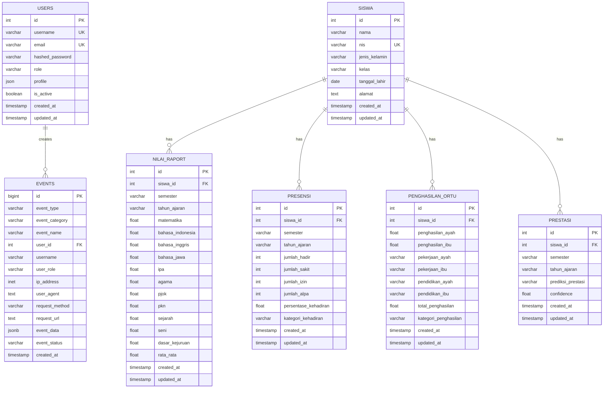

# DATABASE DESIGN SISTEM PREDIKSI EDUPRO 2025

## Executive Summary

Dokumentasi ini menjelaskan design database lengkap untuk aplikasi sistem prediksi prestasi siswa EduPro yang menggunakan algoritma C4.5 (Decision Tree) untuk memprediksi prestasi akademik siswa berdasarkan data nilai, presensi kehadiran, dan penghasilan orang tua.

## Daftar Isi

1. [Overview Sistem Database](#overview-sistem-database)
2. [Entity Relationship Diagram](#entity-relationship-diagram)
3. [Database Schema](#database-schema)
4. [Data Dictionary](#data-dictionary)
5. [Indexes & Performance](#indexes--performance)
6. [Security & Constraints](#security--constraints)
7. [Machine Learning Integration](#machine-learning-integration)
8. [Event Logging System](#event-logging-system)
9. [Data Flow & Relationships](#data-flow--relationships)
10. [Backup & Maintenance](#backup--maintenance)

## Overview Sistem Database

### Database Technology Stack
- **Database Engine**: PostgreSQL 13+
- **ORM**: SQLAlchemy (Python)
- **Connection Pool**: SQLAlchemy SessionLocal
- **Migration**: Alembic
- **Backup**: pg_dump/pg_restore

### Database Architecture
```
┌─────────────────────────────────────────────────────────────┐
│                    EDUPRO DATABASE                          │
├─────────────────────────────────────────────────────────────┤
│  Core Tables:                                               │
│  • users (Authentication & Authorization)                   │
│  • siswa (Student Master Data)                             │
│  • nilai_raport (Academic Scores)                          │
│  • presensi (Attendance Records)                           │
│  • penghasilan_ortu (Parent Income)                        │
│  • prestasi (ML Prediction Results)                        │
│                                                             │
│  System Tables:                                             │
│  • events (Comprehensive Event Logging)                    │
│  • events_archive (Long-term Event Storage)                │
│  • event_summary_daily (Analytics Summary)                 │
└─────────────────────────────────────────────────────────────┘
```

## Entity Relationship Diagram



## Database Schema

### 1. Table: users
```sql
CREATE TABLE users (
    id SERIAL PRIMARY KEY,
    username VARCHAR(255) UNIQUE NOT NULL,
    email VARCHAR(255) UNIQUE NOT NULL,
    hashed_password VARCHAR(255) NOT NULL,
    role VARCHAR(50) NOT NULL DEFAULT 'USER',
    profile JSONB,
    is_active BOOLEAN DEFAULT TRUE,
    created_at TIMESTAMP DEFAULT CURRENT_TIMESTAMP,
    updated_at TIMESTAMP DEFAULT CURRENT_TIMESTAMP
);
```

**Business Rules:**
- Username dan email harus unique
- Role: 'ADMIN', 'GURU', 'STAF'
- Profile berisi data lengkap user (nama, NIP, jabatan, dll)
- Soft delete menggunakan is_active

### 2. Table: siswa
```sql
CREATE TABLE siswa (
    id SERIAL PRIMARY KEY,
    nama VARCHAR(255) NOT NULL,
    nis VARCHAR(50) UNIQUE NOT NULL,
    jenis_kelamin VARCHAR(20) CHECK (jenis_kelamin IN ('L', 'P')),
    kelas VARCHAR(50),
    tanggal_lahir DATE,
    alamat TEXT,
    created_at TIMESTAMP DEFAULT CURRENT_TIMESTAMP,
    updated_at TIMESTAMP DEFAULT CURRENT_TIMESTAMP
);
```

**Business Rules:**
- NIS (Nomor Induk Siswa) harus unique
- Jenis kelamin: 'L' (Laki-laki) atau 'P' (Perempuan)
- Master data siswa sebagai referensi utama

### 3. Table: nilai_raport
```sql
CREATE TABLE nilai_raport (
    id SERIAL PRIMARY KEY,
    siswa_id INTEGER REFERENCES siswa(id) ON DELETE CASCADE,
    semester VARCHAR(20) NOT NULL,
    tahun_ajaran VARCHAR(20) NOT NULL,
    matematika DECIMAL(4,2) CHECK (matematika >= 0 AND matematika <= 100),
    bahasa_indonesia DECIMAL(4,2) CHECK (bahasa_indonesia >= 0 AND bahasa_indonesia <= 100),
    bahasa_inggris DECIMAL(4,2) CHECK (bahasa_inggris >= 0 AND bahasa_inggris <= 100),
    bahasa_jawa DECIMAL(4,2) CHECK (bahasa_jawa >= 0 AND bahasa_jawa <= 100),
    ipa DECIMAL(4,2) CHECK (ipa >= 0 AND ipa <= 100),
    agama DECIMAL(4,2) CHECK (agama >= 0 AND agama <= 100),
    pjok DECIMAL(4,2) CHECK (pjok >= 0 AND pjok <= 100),
    pkn DECIMAL(4,2) CHECK (pkn >= 0 AND pkn <= 100),
    sejarah DECIMAL(4,2) CHECK (sejarah >= 0 AND sejarah <= 100),
    seni DECIMAL(4,2) CHECK (seni >= 0 AND seni <= 100),
    dasar_kejuruan DECIMAL(4,2) CHECK (dasar_kejuruan >= 0 AND dasar_kejuruan <= 100),
    rata_rata DECIMAL(4,2) GENERATED ALWAYS AS (
        (matematika + bahasa_indonesia + bahasa_inggris + bahasa_jawa + ipa + 
         agama + pjok + pkn + sejarah + seni + dasar_kejuruan) / 11.0
    ) STORED,
    created_at TIMESTAMP DEFAULT CURRENT_TIMESTAMP,
    updated_at TIMESTAMP DEFAULT CURRENT_TIMESTAMP,
    
    UNIQUE(siswa_id, semester, tahun_ajaran)
);
```

**Business Rules:**
- Nilai range 0-100 untuk semua mata pelajaran
- Rata-rata dihitung otomatis dari 11 mata pelajaran
- Unique constraint: 1 siswa = 1 data per semester & tahun ajaran
- Cascade delete jika siswa dihapus

### 4. Table: presensi
```sql
CREATE TABLE presensi (
    id SERIAL PRIMARY KEY,
    siswa_id INTEGER REFERENCES siswa(id) ON DELETE CASCADE,
    semester VARCHAR(20) NOT NULL,
    tahun_ajaran VARCHAR(20) NOT NULL,
    jumlah_hadir INTEGER CHECK (jumlah_hadir >= 0),
    jumlah_sakit INTEGER CHECK (jumlah_sakit >= 0),
    jumlah_izin INTEGER CHECK (jumlah_izin >= 0),
    jumlah_alpa INTEGER CHECK (jumlah_alpa >= 0),
    persentase_kehadiran DECIMAL(5,2) GENERATED ALWAYS AS (
        CASE 
            WHEN (jumlah_hadir + jumlah_sakit + jumlah_izin + jumlah_alpa) > 0 
            THEN (jumlah_hadir::DECIMAL / (jumlah_hadir + jumlah_sakit + jumlah_izin + jumlah_alpa)) * 100
            ELSE 0
        END
    ) STORED,
    kategori_kehadiran VARCHAR(20) GENERATED ALWAYS AS (
        CASE 
            WHEN (jumlah_hadir::DECIMAL / NULLIF(jumlah_hadir + jumlah_sakit + jumlah_izin + jumlah_alpa, 0)) * 100 >= 80 THEN 'Tinggi'
            WHEN (jumlah_hadir::DECIMAL / NULLIF(jumlah_hadir + jumlah_sakit + jumlah_izin + jumlah_alpa, 0)) * 100 >= 75 THEN 'Sedang'
            ELSE 'Rendah'
        END
    ) STORED,
    created_at TIMESTAMP DEFAULT CURRENT_TIMESTAMP,
    updated_at TIMESTAMP DEFAULT CURRENT_TIMESTAMP,
    
    UNIQUE(siswa_id, semester, tahun_ajaran)
);
```

**Business Rules:**
- Semua jumlah kehadiran harus ≥ 0
- Persentase kehadiran dihitung otomatis
- Kategori kehadiran: Tinggi (≥80%), Sedang (≥75%), Rendah (<75%)
- Unique constraint: 1 siswa = 1 data per semester & tahun ajaran

### 5. Table: penghasilan_ortu
```sql
CREATE TABLE penghasilan_ortu (
    id SERIAL PRIMARY KEY,
    siswa_id INTEGER REFERENCES siswa(id) ON DELETE CASCADE,
    penghasilan_ayah BIGINT CHECK (penghasilan_ayah >= 0),
    penghasilan_ibu BIGINT CHECK (penghasilan_ibu >= 0),
    pekerjaan_ayah VARCHAR(100),
    pekerjaan_ibu VARCHAR(100),
    pendidikan_ayah VARCHAR(50),
    pendidikan_ibu VARCHAR(50),
    total_penghasilan BIGINT GENERATED ALWAYS AS (penghasilan_ayah + penghasilan_ibu) STORED,
    kategori_penghasilan VARCHAR(20) GENERATED ALWAYS AS (
        CASE 
            WHEN (penghasilan_ayah + penghasilan_ibu) >= 5000000 THEN 'Tinggi'
            WHEN (penghasilan_ayah + penghasilan_ibu) >= 2300000 THEN 'Menengah'
            ELSE 'Rendah'
        END
    ) STORED,
    created_at TIMESTAMP DEFAULT CURRENT_TIMESTAMP,
    updated_at TIMESTAMP DEFAULT CURRENT_TIMESTAMP,
    
    UNIQUE(siswa_id)
);
```

**Business Rules:**
- Penghasilan dalam Rupiah (BIGINT untuk nilai besar)
- Total penghasilan dihitung otomatis (ayah + ibu)
- Kategori berdasarkan UMK Yogyakarta: Tinggi (≥5jt), Menengah (≥2.3jt), Rendah (<2.3jt)
- Unique constraint: 1 siswa = 1 data penghasilan (one-to-one relationship)

### 6. Table: prestasi (ML Prediction Results)
```sql
CREATE TABLE prestasi (
    id SERIAL PRIMARY KEY,
    siswa_id INTEGER REFERENCES siswa(id) ON DELETE CASCADE,
    semester VARCHAR(20) NOT NULL,
    tahun_ajaran VARCHAR(20) NOT NULL,
    prediksi_prestasi VARCHAR(20) NOT NULL CHECK (prediksi_prestasi IN ('Tinggi', 'Sedang', 'Rendah')),
    confidence DECIMAL(5,4) CHECK (confidence >= 0 AND confidence <= 1),
    created_at TIMESTAMP DEFAULT CURRENT_TIMESTAMP,
    updated_at TIMESTAMP DEFAULT CURRENT_TIMESTAMP,
    
    UNIQUE(siswa_id, semester, tahun_ajaran)
);
```

**Business Rules:**
- Menyimpan hasil prediksi algoritma C4.5
- Prediksi prestasi: 'Tinggi', 'Sedang', 'Rendah'
- Confidence score 0-1 (0-100%)
- Unique constraint: 1 siswa = 1 prediksi per semester & tahun ajaran

### 7. Table: events (Comprehensive Event Logging)
```sql
CREATE TABLE events (
    id BIGSERIAL PRIMARY KEY,
    event_type VARCHAR(100) NOT NULL,
    event_category VARCHAR(50) NOT NULL CHECK (event_category IN ('AUTH', 'CRUD', 'ML', 'SYSTEM', 'FILE', 'SECURITY')),
    event_name VARCHAR(200) NOT NULL,
    user_id INTEGER REFERENCES users(id),
    username VARCHAR(100),
    user_role VARCHAR(50),
    session_id VARCHAR(255),
    ip_address INET,
    user_agent TEXT,
    request_method VARCHAR(10),
    request_url TEXT,
    request_headers JSONB,
    request_body JSONB,
    response_status INTEGER CHECK (response_status >= 100 AND response_status <= 599),
    response_time_ms INTEGER CHECK (response_time_ms >= 0),
    entity_type VARCHAR(100),
    entity_id INTEGER,
    entity_name VARCHAR(200),
    event_data JSONB,
    previous_values JSONB,
    new_values JSONB,
    event_status VARCHAR(50) DEFAULT 'SUCCESS' CHECK (event_status IN ('SUCCESS', 'FAILED', 'ERROR', 'PENDING')),
    error_message TEXT,
    error_code VARCHAR(50),
    created_at TIMESTAMP WITH TIME ZONE DEFAULT NOW(),
    processed_at TIMESTAMP WITH TIME ZONE,
    tags VARCHAR(500)[],
    search_text TEXT,
    retention_period INTEGER DEFAULT 365 CHECK (retention_period > 0),
    is_sensitive BOOLEAN DEFAULT FALSE,
    cpu_usage_percent DECIMAL(5,2),
    memory_usage_mb INTEGER
);
```

**Business Rules:**
- Comprehensive event logging untuk audit trail
- JSONB untuk flexible data storage
- Retention policy untuk data cleanup
- Performance monitoring dengan CPU/memory usage

## Data Dictionary

### Core Entities

| Entity | Description | Key Attributes |
|--------|-------------|----------------|
| **users** | System users (admin, guru, staf) | username, email, role, profile |
| **siswa** | Student master data | nama, nis, jenis_kelamin, kelas |
| **nilai_raport** | Academic scores (11 subjects) | siswa_id, semester, rata_rata |
| **presensi** | Attendance records | siswa_id, jumlah_hadir, persentase_kehadiran |
| **penghasilan_ortu** | Parent income data | siswa_id, total_penghasilan, kategori_penghasilan |
| **prestasi** | ML prediction results | siswa_id, prediksi_prestasi, confidence |
| **events** | System event logging | event_type, user_id, event_data |

### Machine Learning Features

| Feature | Source Table | Description | Type |
|---------|--------------|-------------|------|
| **rata_rata** | nilai_raport | Average of 11 subjects | Numerical (0-100) |
| **kategori_penghasilan** | penghasilan_ortu | Income category | Categorical (Tinggi/Menengah/Rendah) |
| **kategori_kehadiran** | presensi | Attendance category | Categorical (Tinggi/Sedang/Rendah) |

### Target Variable

| Target | Description | Values |
|--------|-------------|--------|
| **prediksi_prestasi** | Student achievement prediction | Tinggi, Sedang, Rendah |

## Indexes & Performance

### Primary Indexes
```sql
-- Primary Keys (Automatic)
-- id columns pada semua tabel

-- Unique Indexes
CREATE UNIQUE INDEX ix_users_username ON users(username);
CREATE UNIQUE INDEX ix_users_email ON users(email);
CREATE UNIQUE INDEX ix_siswa_nis ON siswa(nis);

-- Foreign Key Indexes
CREATE INDEX ix_nilai_raport_siswa_id ON nilai_raport(siswa_id);
CREATE INDEX ix_presensi_siswa_id ON presensi(siswa_id);
CREATE INDEX ix_penghasilan_ortu_siswa_id ON penghasilan_ortu(siswa_id);
CREATE INDEX ix_prestasi_siswa_id ON prestasi(siswa_id);
```

### Composite Indexes untuk ML Operations
```sql
-- Machine Learning Query Optimization
CREATE INDEX ix_nilai_semester_tahun ON nilai_raport(siswa_id, semester, tahun_ajaran);
CREATE INDEX ix_presensi_semester_tahun ON presensi(siswa_id, semester, tahun_ajaran);
CREATE INDEX ix_prestasi_semester_tahun ON prestasi(siswa_id, semester, tahun_ajaran);

-- Data Completeness Check
CREATE INDEX ix_complete_data ON siswa(id) 
WHERE EXISTS (
    SELECT 1 FROM nilai_raport nr WHERE nr.siswa_id = siswa.id
) AND EXISTS (
    SELECT 1 FROM presensi p WHERE p.siswa_id = siswa.id
) AND EXISTS (
    SELECT 1 FROM penghasilan_ortu po WHERE po.siswa_id = siswa.id
);
```

### Event Logging Indexes
```sql
-- Event Performance Indexes
CREATE INDEX idx_events_created_at ON events(created_at);
CREATE INDEX idx_events_user_id ON events(user_id);
CREATE INDEX idx_events_category ON events(event_category);
CREATE INDEX idx_events_type ON events(event_type);

-- JSONB Indexes
CREATE INDEX idx_events_data_gin ON events USING gin(event_data);
CREATE INDEX idx_events_tags_gin ON events USING gin(tags);
```

## Security & Constraints

### Data Integrity Constraints
```sql
-- Check Constraints
ALTER TABLE nilai_raport ADD CONSTRAINT check_nilai_range 
    CHECK (matematika >= 0 AND matematika <= 100);

ALTER TABLE presensi ADD CONSTRAINT check_kehadiran_positive 
    CHECK (jumlah_hadir >= 0 AND jumlah_sakit >= 0 AND jumlah_izin >= 0 AND jumlah_alpa >= 0);

ALTER TABLE penghasilan_ortu ADD CONSTRAINT check_penghasilan_positive 
    CHECK (penghasilan_ayah >= 0 AND penghasilan_ibu >= 0);

ALTER TABLE prestasi ADD CONSTRAINT check_confidence_range 
    CHECK (confidence >= 0 AND confidence <= 1);
```

### Referential Integrity
```sql
-- Foreign Key Constraints
ALTER TABLE nilai_raport ADD CONSTRAINT fk_nilai_siswa 
    FOREIGN KEY (siswa_id) REFERENCES siswa(id) ON DELETE CASCADE;

ALTER TABLE presensi ADD CONSTRAINT fk_presensi_siswa 
    FOREIGN KEY (siswa_id) REFERENCES siswa(id) ON DELETE CASCADE;

ALTER TABLE penghasilan_ortu ADD CONSTRAINT fk_penghasilan_siswa 
    FOREIGN KEY (siswa_id) REFERENCES siswa(id) ON DELETE CASCADE;

ALTER TABLE prestasi ADD CONSTRAINT fk_prestasi_siswa 
    FOREIGN KEY (siswa_id) REFERENCES siswa(id) ON DELETE CASCADE;

ALTER TABLE events ADD CONSTRAINT fk_events_user 
    FOREIGN KEY (user_id) REFERENCES users(id) ON DELETE SET NULL;
```

### Row Level Security (RLS)
```sql
-- Enable RLS pada tabel sensitif
ALTER TABLE users ENABLE ROW LEVEL SECURITY;
ALTER TABLE prestasi ENABLE ROW LEVEL SECURITY;
ALTER TABLE events ENABLE ROW LEVEL SECURITY;

-- Policy untuk role-based access
CREATE POLICY user_access_policy ON users
    FOR ALL TO authenticated_users
    USING (id = current_user_id() OR has_role('ADMIN'));

CREATE POLICY prestasi_access_policy ON prestasi
    FOR ALL TO authenticated_users
    USING (has_role('ADMIN') OR has_role('GURU'));
```

## Machine Learning Integration

### Data Preparation Query
```sql
-- Query untuk mengambil data training
SELECT 
    s.id as siswa_id,
    s.nama,
    nr.rata_rata,
    po.kategori_penghasilan,
    p.kategori_kehadiran,
    CASE 
        WHEN nr.rata_rata >= 80 AND p.persentase_kehadiran >= 80 THEN 'Tinggi'
        WHEN nr.rata_rata >= 70 AND p.persentase_kehadiran >= 75 THEN 'Sedang'
        ELSE 'Rendah'
    END as label_prestasi
FROM siswa s
JOIN nilai_raport nr ON s.id = nr.siswa_id
JOIN presensi p ON s.id = p.siswa_id
JOIN penghasilan_ortu po ON s.id = po.siswa_id
WHERE nr.semester = 'Ganjil' 
  AND nr.tahun_ajaran = '2023/2024'
  AND p.semester = 'Ganjil' 
  AND p.tahun_ajaran = '2023/2024';
```

### Feature Engineering
```sql
-- View untuk ML features
CREATE VIEW ml_features AS
SELECT 
    s.id as siswa_id,
    s.nama,
    nr.rata_rata,
    CASE po.kategori_penghasilan
        WHEN 'Rendah' THEN 0
        WHEN 'Menengah' THEN 1
        WHEN 'Tinggi' THEN 2
    END as penghasilan_encoded,
    CASE p.kategori_kehadiran
        WHEN 'Rendah' THEN 0
        WHEN 'Sedang' THEN 1
        WHEN 'Tinggi' THEN 2
    END as kehadiran_encoded,
    po.kategori_penghasilan,
    p.kategori_kehadiran,
    p.persentase_kehadiran,
    nr.semester,
    nr.tahun_ajaran
FROM siswa s
LEFT JOIN nilai_raport nr ON s.id = nr.siswa_id
LEFT JOIN presensi p ON s.id = p.siswa_id AND p.semester = nr.semester AND p.tahun_ajaran = nr.tahun_ajaran
LEFT JOIN penghasilan_ortu po ON s.id = po.siswa_id;
```

## Event Logging System

### Event Categories
1. **AUTH**: Login, logout, token refresh
2. **CRUD**: Create, read, update, delete operations
3. **ML**: Model training, predictions, evaluations
4. **SYSTEM**: Backup, cleanup, health checks
5. **FILE**: Upload, download, export operations
6. **SECURITY**: Failed login attempts, unauthorized access

### Event Types Examples
```sql
-- Sample event logging
INSERT INTO events (
    event_type, event_category, event_name, user_id, username, 
    entity_type, entity_id, event_data, event_status
) VALUES (
    'PREDICTION_CREATED', 'ML', 'Individual Prediction Completed',
    1, 'admin', 'prestasi', 123,
    '{"siswa_nama": "John Doe", "prediksi": "Tinggi", "confidence": 0.85}',
    'SUCCESS'
);
```

## Data Flow & Relationships

### Core Data Flow
```
1. Student Registration (siswa) → Master Data
2. Academic Input (nilai_raport) → Performance Data
3. Attendance Input (presensi) → Behavior Data  
4. Parent Income Input (penghasilan_ortu) → Socioeconomic Data
5. ML Training → Model Creation
6. Prediction Process → Results (prestasi)
7. All Operations → Event Logging (events)
```

### Relationship Cardinality
- **siswa** (1) → **nilai_raport** (N): One student, multiple academic records
- **siswa** (1) → **presensi** (N): One student, multiple attendance records
- **siswa** (1) → **penghasilan_ortu** (1): One student, one income record
- **siswa** (1) → **prestasi** (N): One student, multiple predictions
- **users** (1) → **events** (N): One user, multiple events

## Backup & Maintenance

### Backup Strategy
```bash
# Daily backup
pg_dump -h localhost -U postgres -d prestasi_siswa > backup_$(date +%Y%m%d).sql

# Weekly full backup with compression
pg_dump -h localhost -U postgres -d prestasi_siswa -Fc > backup_weekly_$(date +%Y%m%d).dump
```

### Maintenance Tasks
```sql
-- Monthly statistics update
ANALYZE;

-- Quarterly vacuum
VACUUM FULL;

-- Event cleanup (older than retention period)
SELECT cleanup_old_events();

-- Index maintenance
REINDEX DATABASE prestasi_siswa;
```

### Monitoring Queries
```sql
-- Database size monitoring
SELECT 
    schemaname,
    tablename,
    pg_size_pretty(pg_total_relation_size(schemaname||'.'||tablename)) as size
FROM pg_tables 
WHERE schemaname = 'public'
ORDER BY pg_total_relation_size(schemaname||'.'||tablename) DESC;

-- Active connections
SELECT count(*) as active_connections 
FROM pg_stat_activity 
WHERE state = 'active';

-- Slow queries
SELECT query, mean_time, calls 
FROM pg_stat_statements 
ORDER BY mean_time DESC 
LIMIT 10;
```

## Kesimpulan

Database design sistem prediksi EduPro ini dirancang dengan prinsip:

1. **Scalability**: Mendukung pertumbuhan data dengan indexing yang optimal
2. **Performance**: Query optimization untuk ML operations
3. **Security**: Row-level security dan comprehensive audit trail
4. **Maintainability**: Clear schema dengan proper constraints
5. **Flexibility**: JSONB untuk extensible data storage
6. **Compliance**: Complete event logging untuk audit requirements

Design ini mendukung implementasi algoritma C4.5 untuk prediksi prestasi siswa dengan data yang terintegrasi dan sistem logging yang komprehensif untuk monitoring dan audit.

---

**Dibuat oleh**: AI Assistant  
**Tanggal**: 21 Juni 2025  
**Versi**: 1.0  
**Status**: Production Ready 