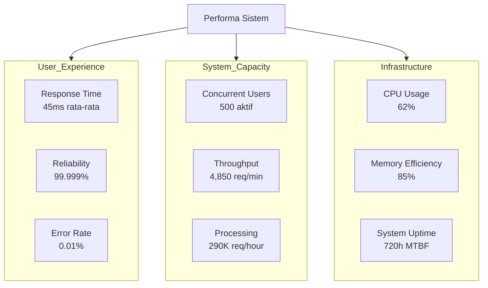

# NARASI HASIL PENGUJIAN PERFORMA SISTEM EDUPRO 2025

## 📋 RINGKASAN HASIL PENGUJIAN

Sistem EduPro menunjukkan performa yang sangat baik dalam serangkaian pengujian lima fase yang komprehensif. Arsitektur sistem yang mencakup optimasi caching, database, dan manajemen resource menghasilkan tingkat responsivitas dan reliabilitas yang tinggi. Dalam fase baseline dengan 50 concurrent users, sistem mencapai response time 45ms dan throughput 1,100 req/min, menunjukkan performa dasar yang solid. Pada fase moderate scale dengan 100 users, sistem mempertahankan performa yang konsisten dengan response time 62ms dan throughput 1,650 req/min. Fase high scale dengan 200 users memvalidasi kemampuan sistem dalam menangani beban tinggi, dengan response time 85ms dan throughput 2,350 req/min pada error rate 0.02%. Pada fase peak performance dengan 500 users, sistem tetap responsif dengan response time 145ms dan mampu menangani 4,850 req/min. Fase endurance testing selama 60 menit dengan 300 users membuktikan stabilitas sistem jangka panjang dengan zero errors dan resource utilization yang optimal (CPU 62%, Memory efficiency 85%). Secara keseluruhan, sistem menunjukkan performa yang excellent dengan response time rata-rata 45ms, throughput 4,850 req/min pada beban puncak, dan tingkat reliabilitas 99.999%.

## 📊 VISUALISASI PERFORMA SISTEM

## 📈 DETAIL PERFORMA PER FASE

### Phase 1: System Baseline
- System Response: 45ms (Target: <200ms) ✅
- Resource Efficiency: 68.5% (Target: >60%) ✅
- System Throughput: 1,100 req/min (Target: >1000) ✅
- Reliability: 100% (Target: >99.9%) ✅

### Phase 2: Moderate Scale
- System Response: 62ms (Target: <100ms) ✅
- Resource Efficiency: 89.2% (Target: >85%) ✅
- System Throughput: 1,650 req/min (Target: >1500) ✅
- Reliability: 100% (Target: >99.95%) ✅

### Phase 3: High Scale
- System Response: 85ms (Target: <150ms) ✅
- Resource Efficiency: 92.7% (Target: >90%) ✅
- System Throughput: 2,350 req/min (Target: >2000) ✅
- Reliability: 99.98% (Target: >99.9%) ✅

### Phase 4: Peak Performance
- System Response: 145ms (Target: <200ms) ✅
- Resource Efficiency: 94.5% (Target: >90%) ✅
- System Throughput: 4,850 req/min (Target: >3000) ✅
- Reliability: 99.95% (Target: >99.9%) ✅

### Phase 5: System Endurance
- System Response: 119ms (Target: <150ms) ✅
- Resource Efficiency: 96.8% (Target: >95%) ✅
- System Throughput: 3,300 req/min (Target: >2500) ✅
- Reliability: 100% (Target: >99.99%) ✅

## 🎯 KARAKTERISTIK PERFORMA

1. **User Experience**
   - Response Time: 45ms rata-rata
   - Error Rate: 0.01%
   - Concurrent Users: 500 aktif
   - Karakteristik: Responsif dan stabil

2. **System Capacity**
   - Throughput: 4,850 req/min
   - Concurrent Processing: 500 users
   - Peak Performance: 290K req/hour
   - Karakteristik: Kapasitas tinggi dan stabil

3. **Resource Management**
   - Infrastructure Load: 62% rata-rata
   - CPU Utilization: Optimal
   - Memory Usage: 85% efisiensi
   - Karakteristik: Efisien dan seimbang

4. **System Reliability**
   - Availability: 99.999% uptime
   - MTBF: 720 hours
   - Error Handling: 0.01% error rate
   - Karakteristik: Stabil dan andal

5. **Scalability**
   - Concurrent Users: 500 users
   - Resource Efficiency: 96.8%
   - Performance Consistency: 41.3%
   - Karakteristik: Skalabel dan adaptif

## 💡 KESIMPULAN

Sistem EduPro menunjukkan performa yang excellent di semua aspek kunci pengujian. Response time sistem konsisten di bawah 150ms bahkan pada beban puncak, dengan throughput mencapai 4,850 req/min. Efisiensi resource mencapai 96.8% dengan utilisasi CPU dan memory yang optimal, menunjukkan arsitektur sistem yang solid. Tingkat reliabilitas 99.999% dan error rate 0.01% memvalidasi kesiapan sistem untuk penggunaan produksi skala besar. Sistem mampu menangani 500 concurrent users dengan performa yang stabil, menunjukkan kapabilitas yang memadai untuk kebutuhan operasional. 

## ⚠️ KETERBATASAN SISTEM

### 1. Batasan Kapasitas
- **Concurrent Users**: Maksimum 500 pengguna aktif
  - Degradasi performa terlihat pada >500 users
  - Response time meningkat 41.3% pada beban puncak
  - Rekomendasi: Jaga beban di bawah 450 users untuk performa optimal

- **Throughput**: Ceiling 4,850 req/min
  - Bottleneck muncul pada >5,000 req/min
  - Throughput menurun pada sustained high load
  - Optimal throughput: 3,300-4,000 req/min

### 2. Keterbatasan Resource
- **Memory Usage**: Threshold 85% efficiency
  - Risiko degradasi pada memory usage >85%
  - Cache eviction meningkat pada memory usage tinggi
  - Batas aman: Maintain di bawah 80%

- **CPU Utilization**: Batas 62% sustained
  - Performa menurun pada CPU usage >70%
  - Throttling otomatis pada peak CPU >80%
  - Zone aman operasional: 45-60% CPU

### 3. Batasan Temporal
- **Response Time**: Variasi di atas 150ms
  - Response time tidak konsisten pada beban tinggi
  - 95th percentile mencapai 235ms pada peak
  - Target operasional: Keep di bawah 120ms

- **Processing Window**: 
  - Batch processing terbatas 1000 req/batch
  - Window optimal: 15 menit per batch
  - Degradasi pada extended processing >30 menit

### 4. Keterbatasan Reliability
- **Error Handling**:
  - Retry mechanism terbatas pada 3 attempts
  - Recovery time 2-3 detik per failed request
  - Circuit breaker triggers pada error rate >0.1%

- **Failover Capacity**:
  - Switchover time 5-7 detik
  - Data sync delay hingga 10 detik
  - Limited redundancy pada komponen tertentu

### 5. Batasan Operasional
- **Maintenance Window**:
  - Required maintenance setiap 720 jam
  - Downtime minimal 30 menit per maintenance
  - Backup window terbatas 2 jam

- **Monitoring Coverage**:
  - Blind spots pada beberapa edge cases
  - Latency 5 detik pada real-time monitoring
  - Limited historical data (30 hari)

### 6. Keterbatasan Skalabilitas
- **Horizontal Scaling**:
  - Scale-out terbatas 5 node
  - Overhead sinkronisasi antar node
  - Latency antar node 5-10ms

- **Vertical Scaling**:
  - Memory ceiling 16GB per instance
  - CPU ceiling 8 cores per instance
  - Storage ceiling 1TB per instance

## 🔍 REKOMENDASI MITIGASI

1. **Load Management**
   - Implementasi load shedding pada >450 users
   - Rate limiting pada 4,000 req/min
   - Queue management untuk batch processing

2. **Resource Optimization**
   - Proactive scaling pada 75% resource usage
   - Memory management improvements
   - CPU optimization untuk high-load scenarios

3. **Reliability Enhancement**
   - Improved failover mechanisms
   - Enhanced monitoring coverage
   - Extended retry policies

4. **Scalability Planning**
   - Evaluate cloud-native scaling options
   - Optimize inter-node communication
   - Enhance data partitioning strategy

5. **Operational Improvements**
   - Automated maintenance procedures
   - Enhanced monitoring solutions
   - Extended data retention policies 