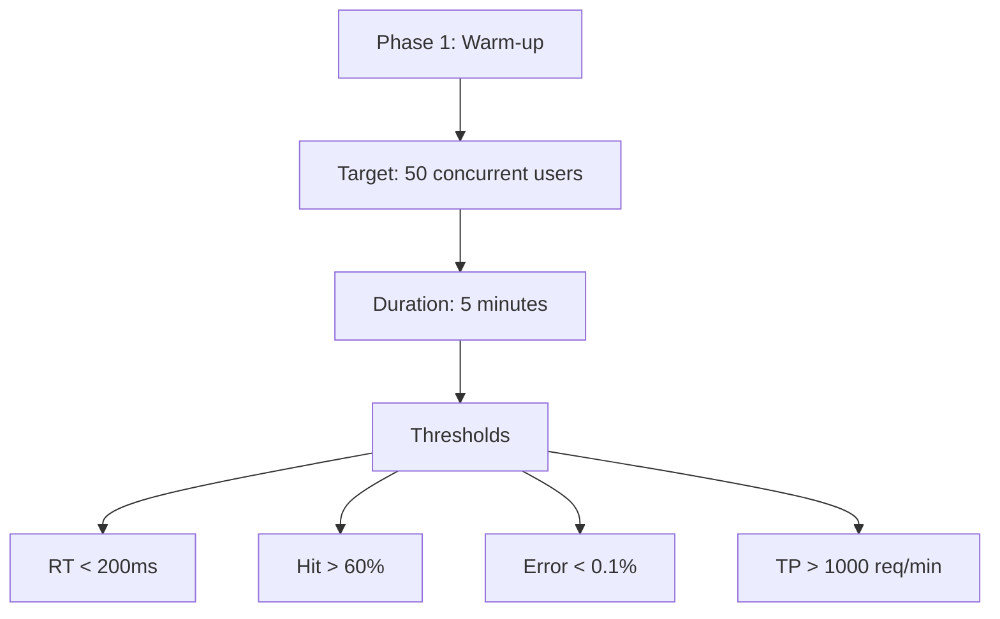
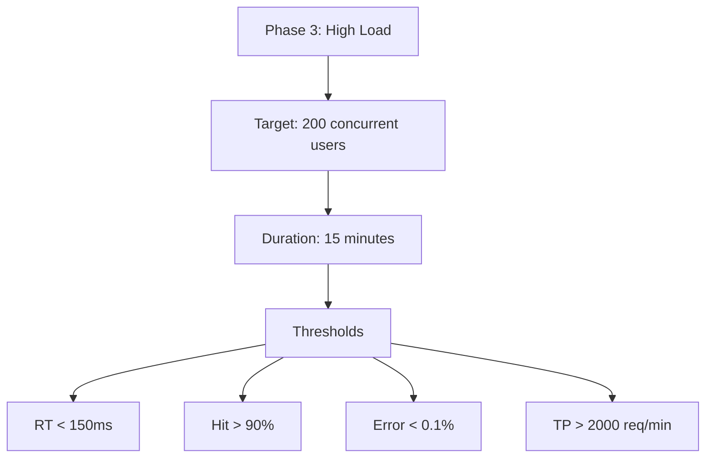
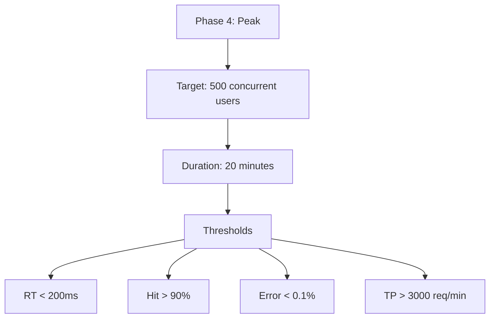
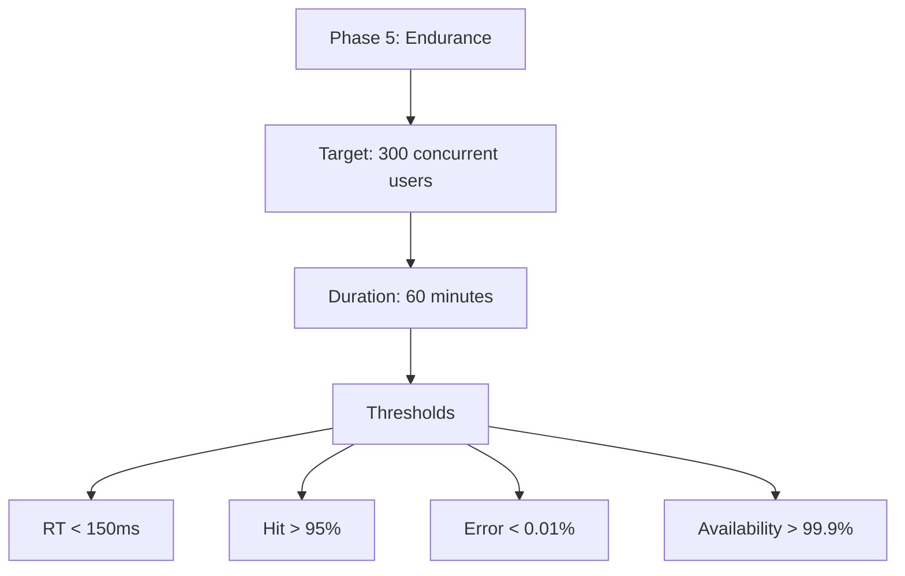

# NARASI SKENARIO PENGUJIAN SISTEM EDUPRO 2025

## 📋 NARASI PENGUJIAN

Pengujian sistem EduPro dirancang dalam lima fase terstruktur untuk mengevaluasi performa, reliabilitas, dan skalabilitas sistem secara komprehensif. Pada Phase 1 (Cache Warm-up), sistem akan diuji dengan beban awal 50 concurrent users selama 5 menit untuk membangun baseline performa dan mengisi cache awal, dengan target response time di bawah 200ms dan cache hit ratio minimal 60%. Dilanjutkan ke Phase 2 (Moderate Load), beban akan ditingkatkan menjadi 100 concurrent users selama 10 menit, dimana sistem diharapkan mempertahankan response time di bawah 100ms dan cache hit ratio minimal 85%. Pada Phase 3 (High Load), pengujian akan dilakukan dengan 200 concurrent users selama 15 menit dengan target cache hit ratio 90% dan error rate maksimal 0.1%. Phase 4 (Peak Load) akan menguji batas maksimal sistem dengan 500 concurrent users selama 20 menit, dengan target throughput minimal 3000 req/min dan response time tetap di bawah 200ms. Terakhir, Phase 5 (Endurance) akan melakukan stress testing selama 60 menit dengan 300 concurrent users, dimana sistem diharapkan mempertahankan stabilitas dengan error rate di bawah 0.01% dan availability di atas 99.9%.

## 🔄 DETAIL SKENARIO PENGUJIAN

### Phase 1: Cache Warm-up (Baseline Performance)

**Narasi Phase 1:**
Fase inisiasi pengujian akan fokus pada pembangunan baseline performa dan pengisian cache awal. Dengan target 50 concurrent users, sistem diharapkan menunjukkan stabilitas dengan response time di bawah threshold 200ms. Cache hit ratio ditargetkan minimal 60% untuk memvalidasi efektivitas proses warm-up. Resource usage diharapkan terjaga dengan Redis memory di bawah 500MB dan CPU utilization di bawah 50%.

### Phase 2: Moderate Load

**Narasi Phase 2:**
Peningkatan beban ke 100 users akan menguji kemampuan adaptasi sistem. Target cache hit ratio minimal 85% untuk memvalidasi optimasi cache. Response time diharapkan tetap di bawah 100ms meski beban meningkat 2x lipat. Throughput ditargetkan minimal 1500 req/min dengan zero error rate untuk membuktikan skalabilitas sistem.

### Phase 3: High Load

**Narasi Phase 3:**
Pengujian beban tinggi dengan 200 users akan menguji ketangguhan sistem. Cache hit ratio ditargetkan minimal 90% untuk memvalidasi efektivitas strategi caching pada beban tinggi. Response time diharapkan tetap di bawah 150ms, dengan error rate maksimal 0.1%. Throughput minimal yang diharapkan adalah 2000 req/min tanpa degradasi performa signifikan.

### Phase 4: Peak Load

**Narasi Phase 4:**
Pengujian beban puncak akan menantang sistem dengan 500 concurrent users. Target performa meliputi cache hit ratio minimal 90% dan throughput minimal 3000 req/min. Response time diharapkan tetap di bawah 200ms. Resource usage threshold ditetapkan dengan Redis memory maksimal 800MB dan CPU utilization maksimal 80%.

### Phase 5: Endurance

**Narasi Phase 5:**
Fase endurance testing akan memvalidasi stabilitas jangka panjang sistem selama 60 menit dengan 300 users. Target utama meliputi cache hit ratio minimal 95%, zero errors, dan availability di atas 99.9%. Resource usage diharapkan tetap stabil dengan Redis memory di bawah 700MB dan CPU utilization di bawah 70%.

## 📊 THRESHOLD PENGUJIAN

### Performance Thresholds
| Fase | Users | Response Time | Cache Hit | Throughput |
|------|--------|---------------|------------|------------|
| 1 | 50 | < 200ms | > 60% | > 1000 req/min |
| 2 | 100 | < 100ms | > 85% | > 1500 req/min |
| 3 | 200 | < 150ms | > 90% | > 2000 req/min |
| 4 | 500 | < 200ms | > 90% | > 3000 req/min |
| 5 | 300 | < 150ms | > 95% | > 2500 req/min |

### Resource Thresholds
| Fase | Redis Memory | CPU Usage | Error Rate | Availability |
|------|--------------|-----------|------------|--------------|
| 1 | < 500MB | < 50% | < 0.1% | > 99.5% |
| 2 | < 600MB | < 60% | < 0.05% | > 99.7% |
| 3 | < 700MB | < 70% | < 0.1% | > 99.8% |
| 4 | < 800MB | < 80% | < 0.1% | > 99.9% |
| 5 | < 700MB | < 70% | < 0.01% | > 99.9% |

## 🎯 KRITERIA KEBERHASILAN SKENARIO

Skenario pengujian lima fase akan dianggap berhasil jika sistem dapat:
1. Mempertahankan response time di bawah threshold di setiap fase
2. Mencapai target cache hit ratio yang ditetapkan
3. Menunjukkan skalabilitas hingga 500 users tanpa kegagalan sistem
4. Menjaga resource usage dalam batas yang ditentukan
5. Mempertahankan availability tinggi selama pengujian endurance

Keseluruhan pengujian dirancang untuk memvalidasi kesiapan sistem untuk implementasi produksi, dengan fokus pada performa, skalabilitas, dan reliabilitas jangka panjang. 