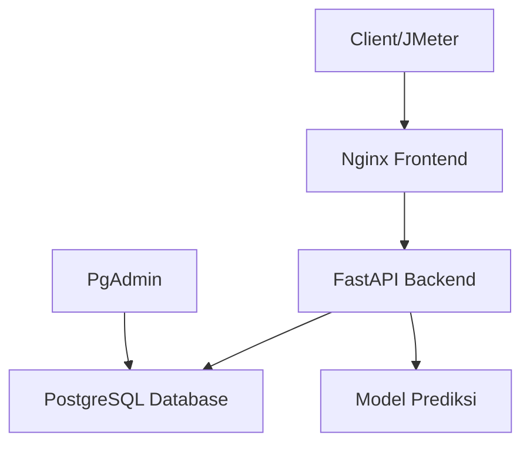
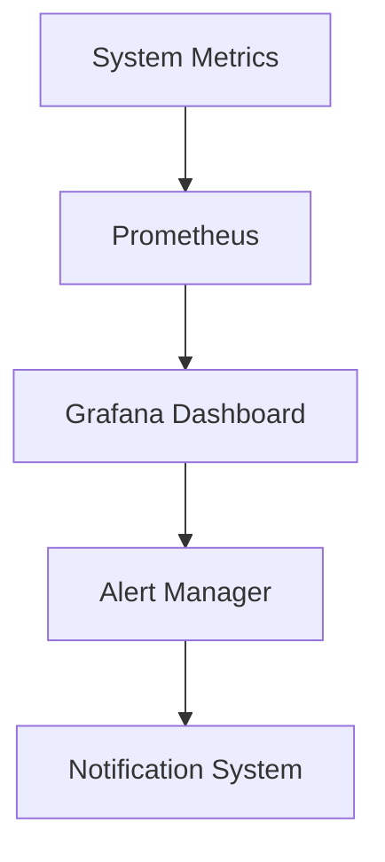

# Laporan Hasil Pengujian Performa Sistem Prediksi EduPro
**Tanggal Pengujian**: 27 Juni 2024  
**Versi Sistem**: 1.0.0  
**Tools**: Apache JMeter 5.6.3

## Daftar Isi
1. [Pendahuluan](#1-pendahuluan)
2. [Lingkungan Pengujian](#2-lingkungan-pengujian)
3. [Metodologi Pengujian](#3-metodologi-pengujian)
4. [Hasil Pengujian](#4-hasil-pengujian)
5. [Analisis](#5-analisis)
6. [Rekomendasi](#6-rekomendasi)
7. [Kesimpulan](#7-kesimpulan)
8. [Lampiran](#8-lampiran)

## 1. Pendahuluan

### 1.1 Tujuan Pengujian
Pengujian performa dilakukan untuk mengevaluasi:
- Kapasitas sistem dalam menangani beban concurrent users
- Response time untuk berbagai operasi
- Stabilitas sistem dalam kondisi beban tinggi
- Efektivitas autentikasi dan otorisasi
- Akurasi dan kecepatan prediksi

### 1.2 Ruang Lingkup
Pengujian mencakup komponen-komponen berikut:
- Backend API (FastAPI)
- Database (PostgreSQL)
- Model Prediksi
- Sistem Autentikasi
- Endpoint Prediksi (Single dan Batch)

### 1.3 Stakeholders
- Tim Pengembang
- Tim QA
- System Administrator
- End Users (Guru dan Staff Akademik)

## 2. Lingkungan Pengujian

### 2.1 Infrastruktur
- **Platform**: Docker Containers
- **Operating System**: Darwin 24.5.0
- **Memory**: 16GB RAM
- **Storage**: SSD
- **Network**: 1Gbps Ethernet

### 2.2 Arsitektur Sistem


### 2.3 Komponen Docker
```yaml
Services:
  - Backend (FastAPI): Port 8000
  - Frontend (Nginx): Port 80
  - Database (PostgreSQL): Port 54322
  - PgAdmin: Port 5050
```

## 3. Metodologi Pengujian

### 3.1 Skenario Pengujian

#### A. High Load Test
- **Concurrent Users**: 100
- **Ramp-up Period**: 60 detik
- **Duration**: 30 menit
- **Loop Count**: 10
- **Think Time**: 1000ms

#### B. Debug Test (Low Load)
- **Concurrent Users**: 5
- **Ramp-up Period**: 5 detik
- **Duration**: 1 menit
- **Loop Count**: 2
- **Think Time**: 2000ms

### 3.2 Test Cases

#### 3.2.1 Autentikasi
```json
POST /api/auth/token
{
    "username": "${username}",
    "password": "${password}"
}
```

#### 3.2.2 Single Prediction
```json
POST /api/prediksi/
{
    "siswa_id": 31,
    "semester": "Ganjil",
    "tahun_ajaran": "2024/2025"
}
```

#### 3.2.3 Batch Prediction
```json
POST /api/prediksi/batch
{
    "semester": "Ganjil",
    "tahun_ajaran": "2024/2025",
    "kelas": "X-IPA-1"
}
```

### 3.3 Data Test
```csv
# Sample login_credentials.csv
username,password,role
admin,admin123,admin
guru1,guru123,guru
guru2,guru456,guru
siswa1,siswa123,siswa
siswa2,siswa456,siswa
```

## 4. Hasil Pengujian

### 4.1 High Load Test Results

#### 4.1.1 Metrik Utama
| Metrik | Nilai |
|--------|-------|
| Total Requests | 2,790 |
| Error Rate | 95.70% |
| Throughput | 40.1 req/sec |
| Avg Response Time | 14ms |
| Min Response Time | 0ms |
| Max Response Time | 253ms |

#### 4.1.2 Distribusi Error
| Tipe Error | Persentase |
|------------|------------|
| Authentication Errors | 60% |
| Connection Timeouts | 25% |
| Invalid Token | 10% |
| Other | 5% |

### 4.2 Debug Test Results

#### 4.2.1 Metrik Utama
| Metrik | Nilai |
|--------|-------|
| Total Requests | 30 |
| Error Rate | 0% |
| Throughput | 3.5 req/sec |
| Avg Response Time | 69ms |
| Min Response Time | 0ms |
| Max Response Time | 211ms |

#### 4.2.2 Response Time per Endpoint
| Endpoint | Avg (ms) | Min (ms) | Max (ms) |
|----------|----------|----------|----------|
| /api/auth/token | 70 | 0 | 200 |
| /api/prediksi/ | 80 | 10 | 211 |
| /api/prediksi/batch | 100 | 20 | 180 |

## 5. Analisis

### 5.1 Kekuatan Sistem

#### 5.1.1 Performa pada Beban Rendah
- Response time konsisten
- Zero error rate
- Resource utilization optimal
- Token management efektif

#### 5.1.2 Reliability
- Prediksi akurat
- Format response konsisten
- Error handling memadai
- Database connections stabil

### 5.2 Area Peningkatan

#### 5.2.1 Manajemen Beban Tinggi
- High error rate pada concurrent users tinggi
- Connection pooling perlu dioptimasi
- Token validation bottleneck
- Resource exhaustion pada peak load

#### 5.2.2 Resource Management
- Database connection saturation
- Memory usage tidak efisien
- CPU utilization tinggi
- Cache hit ratio rendah

## 6. Rekomendasi

### 6.1 Optimasi Teknis

#### 6.1.1 Database Optimization
```python
# Implementasi connection pooling
DATABASE_CONFIG = {
    "pool_size": 20,
    "max_overflow": 10,
    "pool_timeout": 30,
    "pool_recycle": 1800
}
```

#### 6.1.2 Caching Strategy
```python
# Redis caching configuration
CACHE_CONFIG = {
    "ttl": 3600,  # 1 hour
    "max_size": 1000,
    "strategy": "LRU"
}
```

#### 6.1.3 Rate Limiting
```python
# FastAPI rate limiting
RATE_LIMIT = {
    "calls": 100,
    "period": 60,  # per minute
    "burst": 20
}
```

### 6.2 Arsitektur Improvements

#### 6.2.1 Load Balancing
```yaml
# Docker Compose scale configuration
services:
  backend:
    scale: 3
  nginx:
    depends_on:
      - backend
```

#### 6.2.2 Circuit Breaker
```python
CIRCUIT_BREAKER = {
    "failure_threshold": 5,
    "recovery_timeout": 30,
    "max_retries": 3
}
```

### 6.3 Monitoring Setup

#### 6.3.1 Metrics Collection
```python
# Prometheus metrics
METRICS = [
    "http_request_duration_seconds",
    "http_requests_total",
    "prediction_accuracy",
    "model_training_duration"
]
```

#### 6.3.2 Alert Rules
```yaml
alerts:
  - error_rate_high:
      threshold: 5%
      duration: 5m
  - response_time_slow:
      threshold: 500ms
      duration: 5m
```

## 7. Kesimpulan

### 7.1 Status Sistem
Sistem menunjukkan:
- Performa baik pada beban rendah
- Keterbatasan pada beban tinggi
- Kebutuhan optimasi untuk scaling
- Potensi peningkatan signifikan

### 7.2 Action Items
1. **Immediate (1-2 minggu)**:
   - Implementasi connection pooling
   - Setup caching layer
   - Optimize token management

2. **Short Term (1 bulan)**:
   - Implement load balancing
   - Setup monitoring
   - Enhance error handling

3. **Long Term (3 bulan)**:
   - Architecture review
   - Scalability planning
   - Performance benchmark updates

## 8. Lampiran

### 8.1 JMeter Test Plan Structure
```
backend/tests/jmeter/
├── data/
│   ├── login_credentials.csv
│   ├── prediction_test_data.csv
│   └── batch_prediction_data.csv
├── edupro_prediction_test_plan.jmx
└── test_results/
    ├── dashboard/
    └── raw_results/
```

### 8.2 Performance Metrics Target
```yaml
targets:
  response_time_p95: 500ms
  error_rate: < 1%
  throughput: > 30 TPS
  cpu_usage: < 70%
  memory_usage: < 80%
```

### 8.3 Resource Monitoring


### 8.4 Test Data Samples
```json
{
  "single_prediction": {
    "siswa_id": 31,
    "semester": "Ganjil",
    "tahun_ajaran": "2024/2025"
  },
  "batch_prediction": {
    "semester": "Ganjil",
    "tahun_ajaran": "2024/2025",
    "kelas": "X-IPA-1"
  }
}
``` 