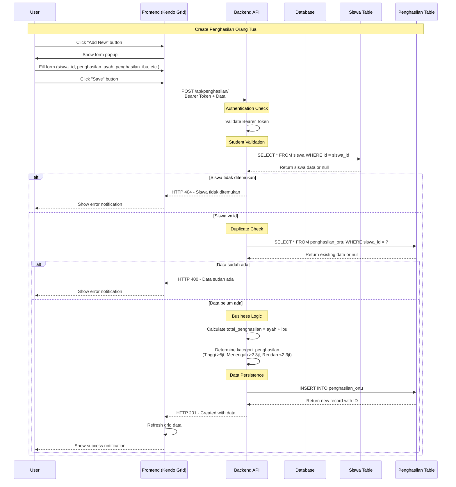
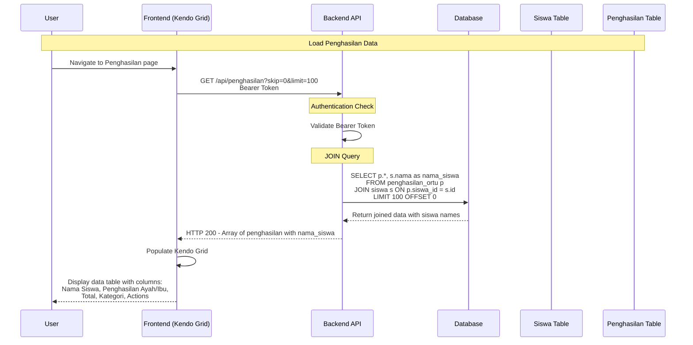
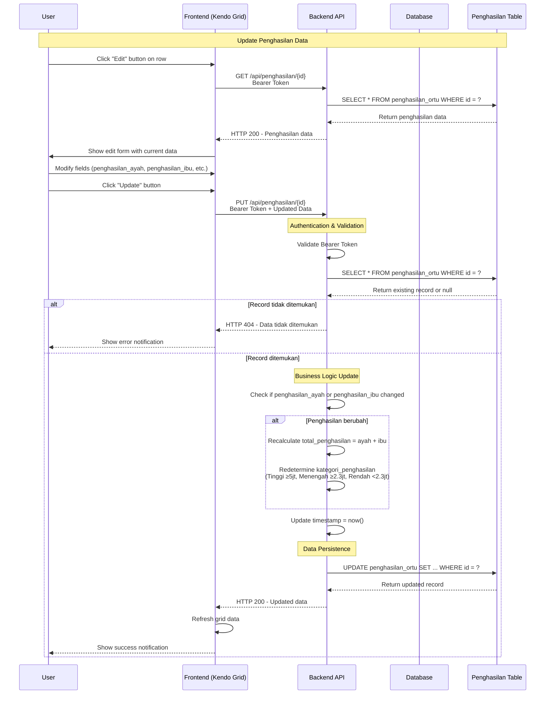
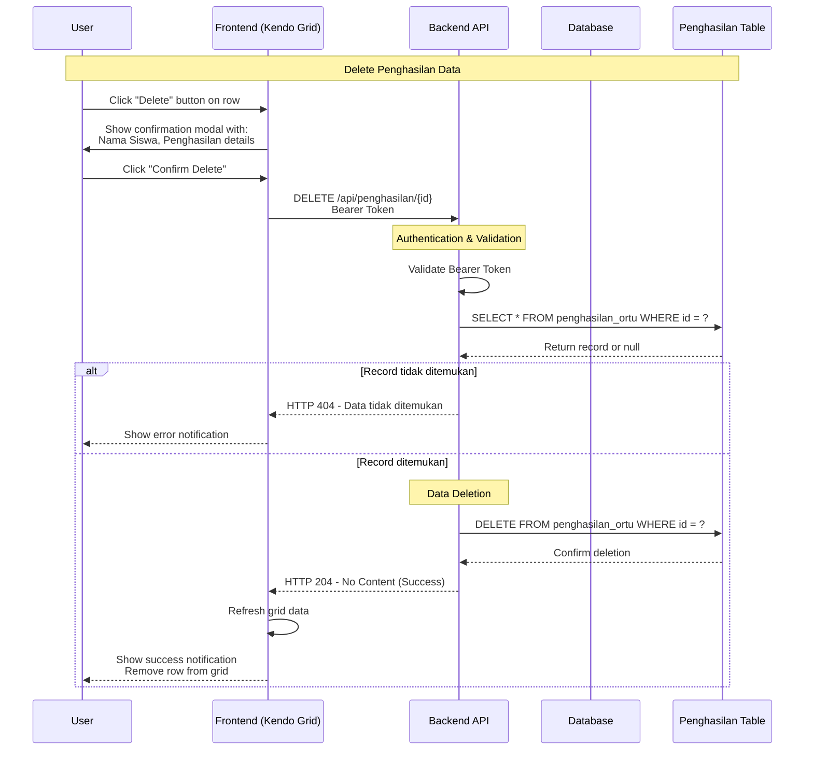
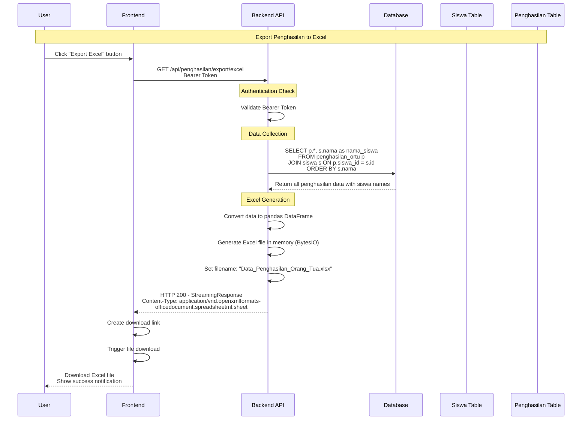
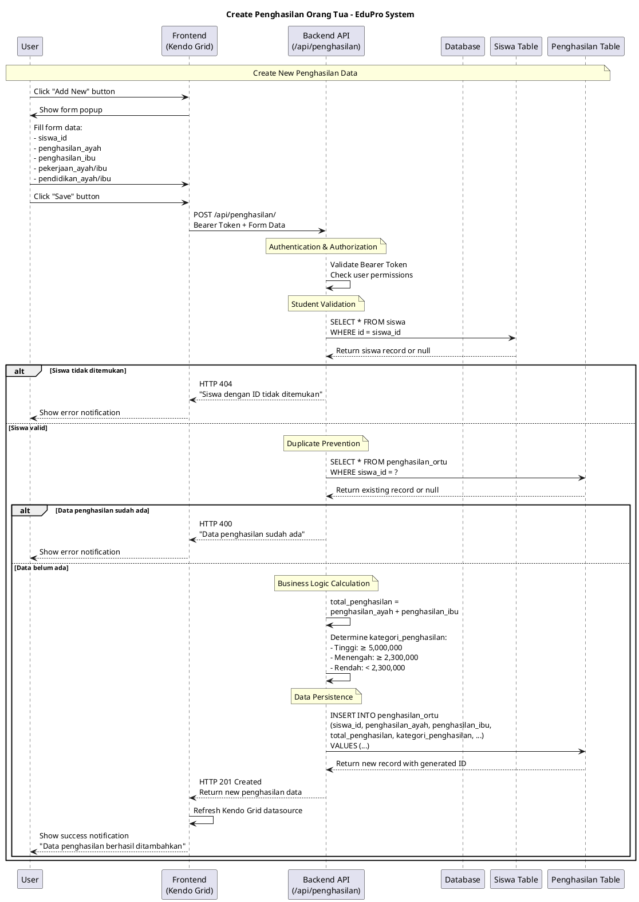
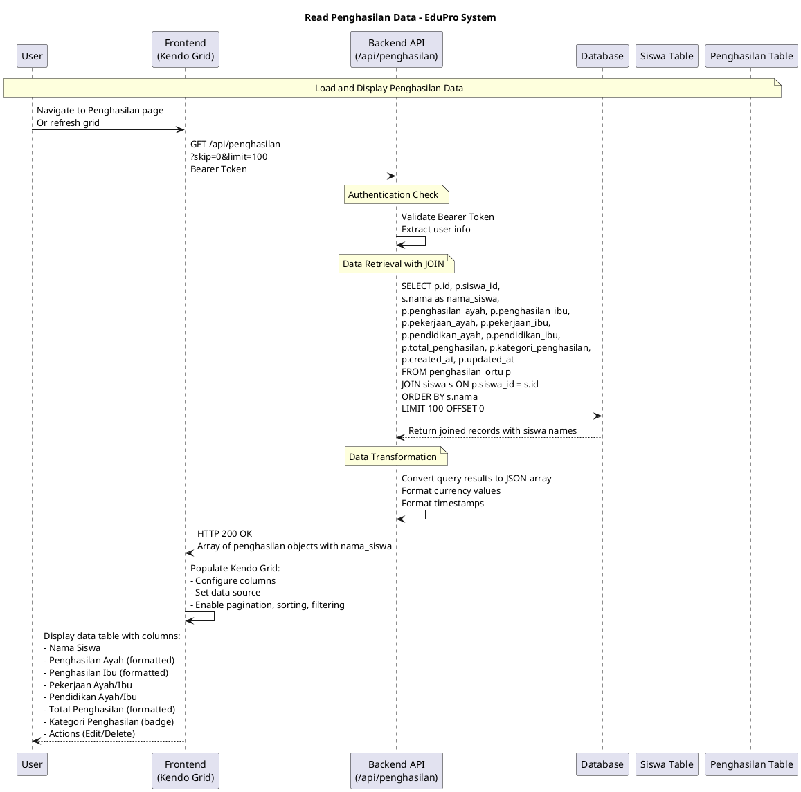
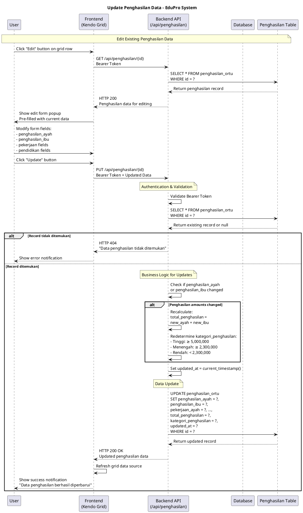
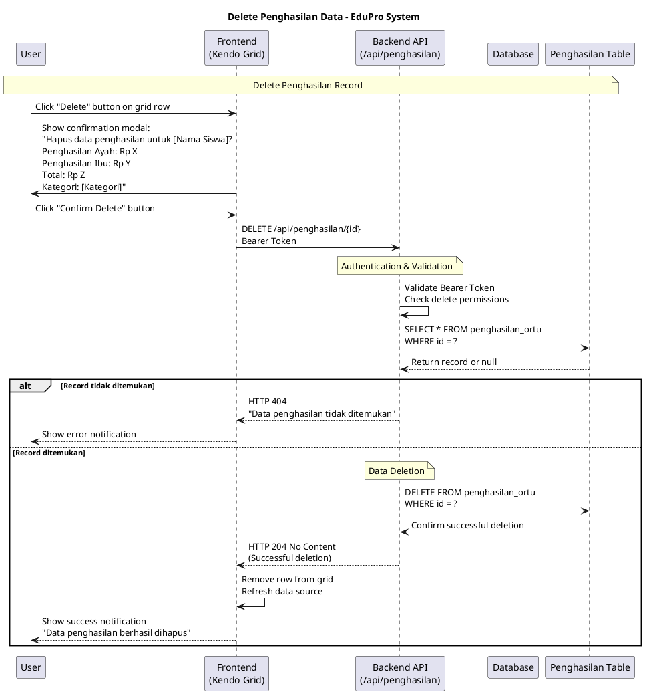
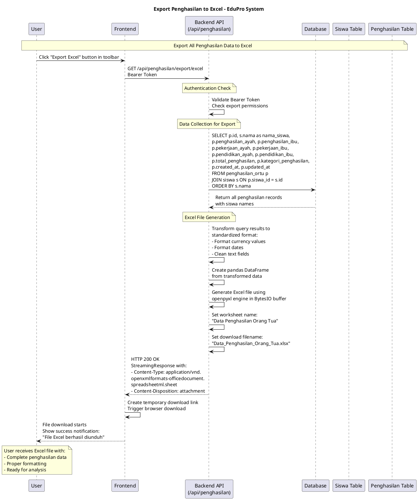

# Sequence Diagram Manajemen Penghasilan - Sistem EduPro

## Executive Summary

Dokumen ini berisi sequence diagram untuk modul manajemen penghasilan orang tua dalam aplikasi EduPro. Diagram menggambarkan alur interaksi antara User, Frontend, Backend API, dan Database untuk operasi CRUD (Create, Read, Update, Delete) data penghasilan orang tua siswa.

## Daftar Isi

1. [Overview Sistem](#overview-sistem)
2. [Sequence Diagram - Format Mermaid](#sequence-diagram-format-mermaid)
3. [Sequence Diagram - Format PlantUML](#sequence-diagram-format-plantuml)
4. [Penjelasan Alur Sistem](#penjelasan-alur-sistem)
5. [Komponen Sistem](#komponen-sistem)
6. [Error Handling](#error-handling)

## Overview Sistem

Modul manajemen penghasilan orang tua memiliki fitur-fitur utama:
- **Create**: Menambah data penghasilan baru dengan validasi siswa
- **Read**: Menampilkan daftar penghasilan dengan JOIN ke tabel siswa
- **Update**: Mengubah data dengan perhitungan ulang total dan kategori
- **Delete**: Menghapus data penghasilan
- **Export**: Export data ke format Excel
- **Authentication**: Semua operasi memerlukan Bearer token

### Fitur Khusus:
- **Auto Calculation**: Total penghasilan = penghasilan_ayah + penghasilan_ibu
- **Auto Categorization**: Kategori berdasarkan total (Rendah/Menengah/Tinggi)
- **Duplicate Prevention**: Satu siswa hanya boleh punya satu data penghasilan
- **JOIN Query**: Data ditampilkan dengan nama siswa

## Sequence Diagram - Format Mermaid

### 1. Create Penghasilan (Tambah Data Baru)



### 2. Read Penghasilan (Tampil Data)



### 3. Update Penghasilan (Edit Data)



### 4. Delete Penghasilan (Hapus Data)



### 5. Export Excel



## Sequence Diagram - Format PlantUML

### 1. Create Penghasilan (Tambah Data Baru)



### 2. Read Penghasilan (Tampil Data)



### 3. Update Penghasilan (Edit Data)



### 4. Delete Penghasilan (Hapus Data)



### 5. Export Excel



## Penjelasan Alur Sistem

### 1. Arsitektur Sistem

Sistem manajemen penghasilan menggunakan arsitektur 4-layer:

1. **Presentation Layer**: Frontend dengan Kendo UI Grid
2. **API Layer**: FastAPI dengan RESTful endpoints
3. **Business Logic Layer**: Validasi, kalkulasi, dan aturan bisnis
4. **Data Layer**: PostgreSQL database dengan relasi

### 2. Fitur-Fitur Khusus

#### Auto Calculation
- **Total Penghasilan**: Otomatis dihitung dari penghasilan_ayah + penghasilan_ibu
- **Kategori Penghasilan**: Otomatis ditentukan berdasarkan total:
  - Tinggi: ≥ Rp 5.000.000 (2x UMK Jogja)
  - Menengah: Rp 2.300.000 - Rp 4.999.999 (UMK Jogja)
  - Rendah: < Rp 2.300.000

#### Data Integrity
- **Unique Constraint**: Satu siswa hanya boleh punya satu data penghasilan
- **Foreign Key**: siswa_id harus valid (ada di tabel siswa)
- **Validation**: Semua field wajib diisi dengan format yang benar

#### Performance Optimization
- **JOIN Query**: Data ditampilkan dengan nama siswa tanpa N+1 query
- **Pagination**: Mendukung skip/limit untuk data besar
- **Indexing**: Primary key dan foreign key terindex

### 3. Security Features

#### Authentication & Authorization
- **Bearer Token**: Semua endpoint memerlukan JWT token
- **Role-based Access**: User harus punya akses ke modul penghasilan
- **Token Validation**: Setiap request divalidasi token-nya

#### Data Protection
- **SQL Injection Prevention**: Menggunakan parameterized query
- **Input Validation**: Validasi di level schema dan database
- **Error Handling**: Error message tidak expose sensitive data

## Komponen Sistem

### 1. Frontend Components

#### Kendo Grid Configuration
```javascript
{
    dataSource: {
        transport: {
            read: { url: "/api/penghasilan", beforeSend: addAuthHeader },
            create: { url: "/api/penghasilan", beforeSend: addAuthHeader },
            update: { url: "/api/penghasilan/{id}", beforeSend: addAuthHeader }
        }
    },
    columns: [
        { field: "nama_siswa", title: "Nama Siswa", width: 180 },
        { field: "penghasilan_ayah", title: "Penghasilan Ayah", width: 125 },
        { field: "penghasilan_ibu", title: "Penghasilan Ibu", width: 100 },
        { field: "total_penghasilan", title: "Total", width: 100 },
        { field: "kategori_penghasilan", title: "Kategori", width: 85 }
    ]
}
```

#### Form Template
```html
<div id="penghasilan-template">
    <div class="form-group">
        <label>Siswa:</label>
        <select data-bind="value: siswa_id" data-role="dropdownlist"></select>
    </div>
    <div class="form-group">
        <label>Penghasilan Ayah:</label>
        <input data-bind="value: penghasilan_ayah" type="number" min="0" />
    </div>
    <!-- ... other fields ... -->
</div>
```

### 2. Backend Components

#### API Router Structure
```python
@router.post("/", response_model=PenghasilanOrtuResponse)
@router.get("/", response_model=List[Dict])
@router.get("/{penghasilan_id}", response_model=PenghasilanOrtuResponse)
@router.put("/{penghasilan_id}", response_model=PenghasilanOrtuResponse)
@router.delete("/{penghasilan_id}", status_code=204)
@router.get("/export/excel")
```

#### Database Schema
```sql
CREATE TABLE penghasilan_ortu (
    id SERIAL PRIMARY KEY,
    siswa_id INTEGER REFERENCES siswa(id),
    penghasilan_ayah DECIMAL(15,2) NOT NULL,
    penghasilan_ibu DECIMAL(15,2) NOT NULL,
    pekerjaan_ayah VARCHAR(100),
    pekerjaan_ibu VARCHAR(100),
    pendidikan_ayah VARCHAR(100),
    pendidikan_ibu VARCHAR(100),
    total_penghasilan DECIMAL(15,2) NOT NULL,
    kategori_penghasilan VARCHAR(20) NOT NULL,
    created_at TIMESTAMP DEFAULT CURRENT_TIMESTAMP,
    updated_at TIMESTAMP DEFAULT CURRENT_TIMESTAMP,
    UNIQUE(siswa_id)
);
```

### 3. Business Logic Components

#### Calculation Engine
```python
def calculate_income_category(total_penghasilan: float) -> str:
    if total_penghasilan >= 5000000:
        return "Tinggi"
    elif total_penghasilan >= 2300000:
        return "Menengah"
    else:
        return "Rendah"
```

#### Validation Rules
```python
def validate_penghasilan_data(data: PenghasilanOrtuCreate, db: Session):
    # Check if student exists
    siswa = db.query(Siswa).filter(Siswa.id == data.siswa_id).first()
    if not siswa:
        raise HTTPException(404, "Siswa tidak ditemukan")
    
    # Check for duplicates
    existing = db.query(PenghasilanOrtu).filter(
        PenghasilanOrtu.siswa_id == data.siswa_id
    ).first()
    if existing:
        raise HTTPException(400, "Data penghasilan sudah ada")
```

## Error Handling

### 1. HTTP Status Codes

| Status Code | Scenario | Response |
|-------------|----------|----------|
| 200 | Success (Read/Update) | Data returned |
| 201 | Success (Create) | New data returned |
| 204 | Success (Delete) | No content |
| 400 | Bad Request | Validation error/duplicate |
| 401 | Unauthorized | Invalid/missing token |
| 404 | Not Found | Resource doesn't exist |
| 500 | Server Error | Internal server error |

### 2. Error Response Format

```json
{
    "detail": "Error message in Indonesian",
    "status_code": 400,
    "timestamp": "2025-06-21T10:30:00Z"
}
```

### 3. Frontend Error Handling

```javascript
// Kendo Grid error handling
error: function(e) {
    if (e.status === 401) {
        showErrorNotification("Sesi telah berakhir, silakan login kembali");
        redirectToLogin();
    } else if (e.status === 400) {
        showErrorNotification(e.responseJSON.detail);
    } else {
        showErrorNotification("Terjadi kesalahan sistem");
    }
}
```

### 4. Common Error Scenarios

1. **Siswa tidak ditemukan**: Saat create/update dengan siswa_id invalid
2. **Data duplikat**: Saat create untuk siswa yang sudah punya data penghasilan  
3. **Token expired**: Saat melakukan operasi dengan token yang sudah kadaluarsa
4. **Validation error**: Saat input data tidak sesuai format/constraint
5. **Network error**: Saat koneksi ke backend bermasalah

## Kesimpulan

Sequence diagram manajemen penghasilan menunjukkan alur sistem yang komprehensif dengan fitur:

- ✅ **Complete CRUD Operations** dengan validasi dan error handling
- ✅ **Auto Calculation** untuk total dan kategori penghasilan  
- ✅ **Data Integrity** dengan foreign key dan unique constraints
- ✅ **Security** dengan Bearer token authentication
- ✅ **Performance** dengan JOIN query dan pagination
- ✅ **Export Functionality** ke format Excel
- ✅ **User Experience** dengan confirmation modal dan notifications

Sistem ini siap untuk production dengan dokumentasi lengkap dan implementasi yang robust.

---

**Dibuat pada**: 21 Juni 2025  
**Versi**: 1.0  
**Status**: Production Ready  
**Sistem**: EduPro - Sistem Informasi Prediksi Prestasi Siswa 