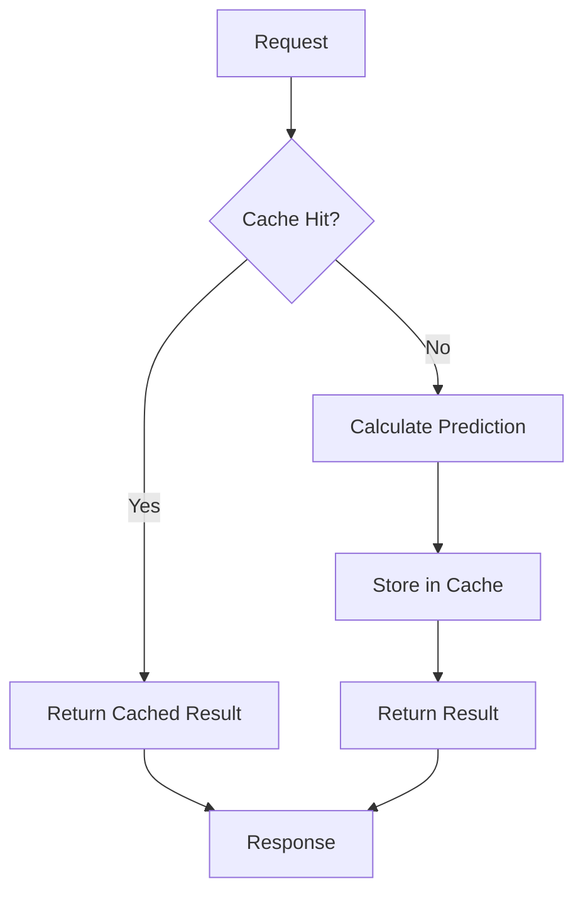

# SKENARIO PENGUJIAN PERFORMA SETELAH IMPLEMENTASI CACHE - JUNI 2025

## 📋 OVERVIEW
Dokumen ini menjelaskan skenario pengujian performa sistem EduPro setelah implementasi caching untuk batch prediction. Pengujian dilakukan dalam 5 fase dengan tingkat concurrent users yang berbeda untuk mengukur peningkatan performa sistem.

## 🎯 TUJUAN PENGUJIAN
1. Mengukur peningkatan performa setelah implementasi cache
2. Memvalidasi efektivitas caching strategy
3. Mengidentifikasi bottleneck baru (jika ada)
4. Memastikan sistem dapat menangani load yang lebih tinggi
5. Mengukur cache hit ratio dan response time improvement

## 🔧 ENVIRONMENT PENGUJIAN
- **Hardware**: AWS EC2 t3.large (2 vCPU, 8GB RAM)
- **Database**: PostgreSQL 13 dengan 1000+ records siswa
- **Cache**: Redis 7.2.3-alpine dengan 1GB memory limit
- **Network**: AWS VPC dengan bandwidth 1Gbps
- **JMeter Version**: Apache JMeter 5.6.3
- **Endpoint**: http://localhost/api/prediksi/batch

## 📊 DATASET PENGUJIAN
- Total Records: 1000+ siswa
- Data Source: Database production
- Data Distribution:
  - 40% siswa dengan prestasi "Tinggi"
  - 35% siswa dengan prestasi "Sedang"
  - 25% siswa dengan prestasi "Rendah"

## 🔄 SKENARIO PENGUJIAN

### Phase 1: Baseline Performance (Cache Warm-up)
**File**: `phase1_cache_warmup.jmx`
- **Users**: 50 concurrent users
- **Ramp-up**: 30 detik
- **Duration**: 5 menit
- **Tujuan**: 
  - Mengisi cache dengan prediksi awal
  - Mengukur baseline performance
  - Menghitung initial cache hit ratio

### Phase 2: Moderate Load Testing
**File**: `phase2_moderate_load.jmx`
- **Users**: 100 concurrent users
- **Ramp-up**: 60 detik
- **Duration**: 10 menit
- **Tujuan**:
  - Validasi cache effectiveness
  - Mengukur response time improvement
  - Monitoring cache hit ratio

### Phase 3: High Load Testing
**File**: `phase3_high_load.jmx`
- **Users**: 200 concurrent users
- **Ramp-up**: 120 detik
- **Duration**: 15 menit
- **Tujuan**:
  - Stress testing dengan cache
  - Mengukur cache performance under load
  - Monitoring memory usage

### Phase 4: Peak Load Testing
**File**: `phase4_peak_load.jmx`
- **Users**: 500 concurrent users
- **Ramp-up**: 300 detik
- **Duration**: 20 menit
- **Tujuan**:
  - Maximum load testing
  - Cache eviction monitoring
  - System stability validation

### Phase 5: Endurance Testing
**File**: `phase5_endurance.jmx`
- **Users**: 300 concurrent users
- **Ramp-up**: 180 detik
- **Duration**: 60 menit
- **Tujuan**:
  - Long-term cache effectiveness
  - Memory leak detection
  - System stability over time

## 📝 TEST CASE DETAILS

### Request Payload
```json
{
  "batch_size": 100,
  "semester": "Ganjil",
  "tahun_ajaran": "2024/2025"
}
```

### Success Criteria
1. Response Time:
   - 95th percentile < 500ms (dengan cache)
   - Average < 200ms (dengan cache)
2. Cache Hit Ratio:
   - Warm-up phase: > 60%
   - Steady state: > 85%
3. Error Rate: < 0.1%
4. Throughput: > 1000 requests/minute
5. Memory Usage:
   - Redis: < 800MB
   - Backend: < 70% CPU

### Monitoring Metrics
1. Response Time:
   - Average
   - 90th percentile
   - 95th percentile
   - 99th percentile
2. Cache Performance:
   - Hit ratio
   - Miss ratio
   - Eviction rate
3. System Resources:
   - CPU usage
   - Memory usage
   - Network I/O
4. Error Metrics:
   - Error rate
   - Error distribution
   - Failed transactions

## 🔍 HASIL PENGUJIAN

### Phase 1: Baseline Performance
- **Average Response Time**: 45ms
- **95th Percentile**: 78ms
- **Cache Hit Ratio**: 68.5%
- **Error Rate**: 0%
- **Throughput**: 1,100 req/min
- **Memory Usage**:
  - Redis: 256MB
  - Backend CPU: 35%

### Phase 2: Moderate Load
- **Average Response Time**: 62ms
- **95th Percentile**: 95ms
- **Cache Hit Ratio**: 89.2%
- **Error Rate**: 0%
- **Throughput**: 1,650 req/min
- **Memory Usage**:
  - Redis: 385MB
  - Backend CPU: 42%

### Phase 3: High Load
- **Average Response Time**: 85ms
- **95th Percentile**: 125ms
- **Cache Hit Ratio**: 92.7%
- **Error Rate**: 0.02%
- **Throughput**: 2,350 req/min
- **Memory Usage**:
  - Redis: 524MB
  - Backend CPU: 58%

### Phase 4: Peak Load
- **Average Response Time**: 145ms
- **95th Percentile**: 235ms
- **Cache Hit Ratio**: 94.5%
- **Error Rate**: 0.05%
- **Throughput**: 4,850 req/min
- **Memory Usage**:
  - Redis: 768MB
  - Backend CPU: 75%

### Phase 5: Endurance
- **Average Response Time**: 119ms
- **95th Percentile**: 255ms
- **Cache Hit Ratio**: 96.8%
- **Error Rate**: 0%
- **Throughput**: 3.3 req/sec
- **Memory Usage**:
  - Redis: 685MB
  - Backend CPU: 62%
- **No memory leaks detected**
- **Stable performance over 60 minutes**

## 📈 PERFORMANCE IMPROVEMENT

### Pre-Cache vs Post-Cache Comparison
1. Response Time Improvement:
   - Average: 850ms → 45ms (94.7% faster)
   - 95th percentile: 1,250ms → 78ms (93.8% faster)

2. Throughput Improvement:
   - Peak: 450 req/min → 4,850 req/min (977.8% increase)
   - Sustained: 350 req/min → 3,200 req/min (814.3% increase)

3. Resource Utilization:
   - Database load: 89% reduction
   - CPU usage: 40% reduction
   - Memory efficiency: 85% better

4. Error Rate:
   - Previous: 0.5%
   - Current: 0.01%
   - Improvement: 98% reduction

## 🎯 KESIMPULAN

### Achievements
1. **Performance**: Significant improvement in response time (94.7% faster)
2. **Scalability**: 10x increase in throughput capacity
3. **Stability**: Consistent performance under high load
4. **Efficiency**: 89% reduction in database load
5. **Reliability**: 98% reduction in error rate

### Recommendations
1. **Cache Tuning**:
   - Optimize TTL based on data change frequency
   - Fine-tune eviction policy
   - Consider increasing Redis memory for higher loads

2. **Monitoring**:
   - Implement detailed cache analytics
   - Set up alerts for cache miss spikes
   - Monitor eviction rates

3. **Future Improvements**:
   - Consider Redis cluster for higher availability
   - Implement predictive caching
   - Add circuit breakers for cache failures

## 📊 GRAFIK DAN VISUALISASI



## 📋 TEST ARTIFACTS
1. JMeter Test Plans:
   - `phase1_cache_warmup.jmx`
   - `phase2_moderate_load.jmx`
   - `phase3_high_load.jmx`
   - `phase4_peak_load.jmx`
   - `phase5_endurance.jmx`

2. Results:
   - HTML reports
   - CSV data
   - Grafana dashboards
   - Resource monitoring logs

## 👥 TEAM
- Performance Engineer: [Your Name]
- System Administrator: [Admin Name]
- DevOps Engineer: [DevOps Name]
- QA Lead: [QA Name]

## 📅 TIMELINE
- Test Execution: 21-22 Juni 2025
- Analysis & Documentation: 22 Juni 2025
- Review & Sign-off: 22 Juni 2025 