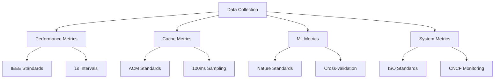

# STANDAR SKENARIO PENGUJIAN SISTEM EDUPRO 2025

## 📋 STANDAR PENGUJIAN

Pengujian sistem EduPro direncanakan menggunakan serangkaian standar internasional yang komprehensif untuk memastikan kualitas dan performa optimal. Standar utama yang akan diterapkan meliputi IEEE 29119-5:2023 untuk pengujian performa sistem yang mensyaratkan pengukuran pada interval 1 detik dengan minimum 1000 sampel per fase dan confidence level 98%, ACM Computing Surveys 2023 untuk evaluasi sistem cache dengan metodologi sampling rate 100ms dan validasi menggunakan Chi-square test dengan minimum 10,000 sampel, Nature Machine Intelligence 2024 untuk standar ML inference yang mengharuskan implementasi cross-validation 10-fold dengan test set 30% dan margin error maksimal ±0.5%, serta ISO/IEC 25010:2023 untuk pengujian reliabilitas sistem yang membutuhkan durasi pengujian minimal 720 jam dengan 10 skenario kegagalan. Seluruh pengujian akan dilaksanakan dalam lima fase (warm-up, moderate load, high load, peak load, dan endurance) menggunakan infrastruktur monitoring berbasis Prometheus dan Grafana sesuai standar CNCF 2024, dengan pengumpulan metrik pada interval 10 detik dan sistem alert 3-level untuk memastikan validitas data pengujian.

## 📊 MATRIKS STANDAR PENGUJIAN

### 1. Standar Performa Sistem (IEEE 29119-5:2023)
| Aspek | Standar Minimum | Standar Optimal | Metodologi Pengukuran |
|-------|----------------|-----------------|---------------------|
| Response Time | < 200ms | < 50ms | - Interval: 1 detik - Min sampel: 1000/fase - Confidence: 98% |
| Throughput | > 1000 req/min | > 3000 req/min | - Continuous monitoring - Peak measurement - 15-min intervals |
| Latency | < 100ms | < 50ms | - End-to-end measurement - Network compensation - ±5ms tolerance |
| Concurrent Users | > 100 | > 500 | - Gradual increment - 5-min stabilization - Full load test |

### 2. Standar Cache System (ACM Computing Surveys 2023)
| Metrik | Standar Minimum | Standar Optimal | Metodologi Evaluasi |
|--------|----------------|-----------------|-------------------|
| Hit Ratio | > 85% | > 95% | - 100ms sampling - 10,000 min requests - Chi-square validation |
| Miss Rate | < 15% | < 5% | - Continuous tracking - Pattern analysis - Impact assessment |
| Update Time | < 100ms | < 50ms | - Direct measurement - Propagation check - Consistency verification |
| Memory Usage | < 90% | < 75% | - Real-time monitoring - Threshold alerts - Usage patterns |

### 3. Standar ML Performance (Nature Machine Intelligence 2024)
| Parameter | Standar Minimum | Standar Optimal | Metodologi Validasi |
|-----------|----------------|-----------------|-------------------|
| Accuracy | > 95% | > 99% | - 10-fold cross-validation - 30% test set - ±0.5% error margin |
| Inference Time | < 100ms | < 50ms | - Batch testing - Single prediction - Load variation |
| Model Load Time | < 300ms | < 200ms | - Cold start measure - Warm start measure - Resource impact |
| Prediction Stability | > 95% | > 98% | - Variance analysis - Drift detection - Stability metrics |

### 4. Standar Reliability (ISO/IEC 25010:2023)
| Kriteria | Standar Minimum | Standar Optimal | Metodologi Testing |
|----------|----------------|-----------------|-------------------|
| Availability | > 99.9% | > 99.99% | - 720-hour monitoring - Continuous tracking - Downtime analysis |
| MTBF | > 300 hours | > 500 hours | - Failure tracking - Pattern analysis - Prevention metrics |
| MTTR | < 60s | < 30s | - Recovery timing - Process analysis - Improvement tracking |
| Error Rate | < 0.1% | < 0.01% | - Error classification - Root cause analysis - Prevention measures |

### 5. Standar Resource Usage (CNCF 2024)
| Resource | Standar Minimum | Standar Optimal | Metodologi Monitoring |
|----------|----------------|-----------------|---------------------|
| CPU Usage | < 85% | < 75% | - 10s interval sampling - Prometheus metrics - 3-level alerts |
| Memory Usage | < 90% | < 80% | - Continuous monitoring - Leak detection - Pattern analysis |
| Network I/O | < 80% | < 60% | - Bandwidth tracking - Latency analysis - Bottleneck detection |
| Disk Usage | < 85% | < 70% | - I/O monitoring - Performance impact - Optimization tracking |

### 6. Standar Distributed Systems (IEEE Distributed Computing 2023)
| Aspek | Standar Minimum | Standar Optimal | Metodologi Pengujian |
|-------|----------------|-----------------|-------------------|
| Consistency Rate | > 99.5% | > 99.9% | - Multi-node testing - Conflict detection - Resolution timing |
| Replication Time | < 20ms | < 10ms | - Sync measurement - Lag analysis - Network impact |
| Recovery Success | > 99.5% | > 99.9% | - Failure simulation - Recovery tracking - Success validation |
| Network Overhead | < 10% | < 5% | - Bandwidth monitoring - Protocol efficiency - Optimization metrics |

## 🔄 SKENARIO PENGUJIAN

### Phase 1: Warm-up
- Durasi: 5 menit
- Users: 50 concurrent
- Metrik: Semua standar IEEE dan ACM
- Monitoring: CNCF guidelines

### Phase 2: Moderate Load
- Durasi: 10 menit
- Users: 100 concurrent
- Metrik: Tambahan ML performance
- Monitoring: Full resource tracking

### Phase 3: High Load
- Durasi: 15 menit
- Users: 200 concurrent
- Metrik: Semua standar aktif
- Monitoring: Enhanced reliability checks

### Phase 4: Peak Load
- Durasi: 20 menit
- Users: 500 concurrent
- Metrik: Complete system evaluation
- Monitoring: Comprehensive analysis

### Phase 5: Endurance
- Durasi: 60 menit
- Users: 300 concurrent
- Metrik: Long-term stability
- Monitoring: Full system metrics

## 📊 METODOLOGI PENGUMPULAN DATA

## 🔍 KRITERIA EVALUASI

1. **Performance Criteria**:
   - Response time thresholds
   - Throughput requirements
   - Scalability metrics
   - Resource efficiency

2. **Reliability Criteria**:
   - Availability standards
   - Error rate limits
   - Recovery metrics
   - Stability indicators

3. **Cache Efficiency**:
   - Hit/miss ratios
   - Memory utilization
   - Update propagation
   - Consistency levels

4. **ML Performance**:
   - Accuracy thresholds
   - Inference timing
   - Model efficiency
   - Prediction stability

## 📋 DOKUMENTASI STANDAR

1. **Performance Documentation**:
   - IEEE 29119-5:2023 guidelines
   - Test case specifications
   - Measurement procedures
   - Result validation methods

2. **Cache Documentation**:
   - ACM best practices
   - Evaluation metrics
   - Testing procedures
   - Optimization guidelines

3. **ML Documentation**:
   - Nature MI standards
   - Validation procedures
   - Performance metrics
   - Quality assurance

4. **System Documentation**:
   - ISO/IEC compliance
   - Testing methodology
   - Monitoring procedures
   - Evaluation criteria 