# Use Case Diagram - Sistem Prediksi Prestasi Siswa

## 📋 Use Case Diagram dalam Format PlantUML

```plantuml
@startuml
!theme plain
title Use Case Diagram - Sistem Prediksi Prestasi Siswa

' Actors
actor "Admin/Guru" as Admin
actor "Sistem" as System

' System boundary
rectangle "Sistem Prediksi Prestasi Siswa" {
    
    ' Authentication Use Cases
    package "Authentication" {
        usecase "Login" as UC1
        usecase "Register User" as UC2
        usecase "Manage Users" as UC3
        usecase "Logout" as UC4
    }
    
    ' Data Management Use Cases
    package "Manajemen Data Siswa" {
        usecase "Tambah Data Siswa" as UC5
        usecase "Lihat Data Siswa" as UC6
        usecase "Edit Data Siswa" as UC7
        usecase "Hapus Data Siswa" as UC8
        usecase "Cari Data Siswa" as UC9
        usecase "Import Data dari Excel" as UC10
        usecase "Export Data ke Excel" as UC11
    }
    
    package "Manajemen Nilai Raport" {
        usecase "Input Nilai Raport" as UC12
        usecase "Lihat Nilai Raport" as UC13
        usecase "Edit Nilai Raport" as UC14
        usecase "Hapus Nilai Raport" as UC15
        usecase "Hitung Rata-rata Otomatis" as UC16
    }
    
    package "Manajemen Data Presensi" {
        usecase "Input Data Presensi" as UC17
        usecase "Lihat Data Presensi" as UC18
        usecase "Edit Data Presensi" as UC19
        usecase "Hapus Data Presensi" as UC20
        usecase "Hitung Persentase Kehadiran" as UC21
    }
    
    package "Manajemen Penghasilan Orang Tua" {
        usecase "Input Data Penghasilan" as UC22
        usecase "Lihat Data Penghasilan" as UC23
        usecase "Edit Data Penghasilan" as UC24
        usecase "Hapus Data Penghasilan" as UC25
        usecase "Kategorisasi Penghasilan" as UC26
    }
    
    ' Machine Learning Use Cases
    package "Prediksi Prestasi (Machine Learning)" {
        usecase "Latih Model C4.5" as UC27
        usecase "Prediksi Prestasi Siswa" as UC28
        usecase "Prediksi Batch Multiple Siswa" as UC29
        usecase "Lihat Aturan Keputusan" as UC30
        usecase "Visualisasi Pohon Keputusan" as UC31
        usecase "Generate Data Dummy" as UC32
        usecase "Lihat Informasi Model" as UC33
        usecase "Simpan Hasil Prediksi" as UC34
    }
    
    ' System Use Cases
    package "Sistem Internal" {
        usecase "Validasi Data" as UC35
        usecase "Generate JWT Token" as UC36
        usecase "Hash Password" as UC37
        usecase "Database Operations" as UC38
        usecase "Error Handling" as UC39
        usecase "API Documentation" as UC40
    }
}

' Actor-Use Case Relationships
Admin --> UC1 : login
Admin --> UC2 : register new user
Admin --> UC3 : manage users
Admin --> UC4 : logout

Admin --> UC5 : add student
Admin --> UC6 : view students
Admin --> UC7 : edit student
Admin --> UC8 : delete student
Admin --> UC9 : search student
Admin --> UC10 : import from excel
Admin --> UC11 : export to excel

Admin --> UC12 : input grades
Admin --> UC13 : view grades
Admin --> UC14 : edit grades
Admin --> UC15 : delete grades

Admin --> UC17 : input attendance
Admin --> UC18 : view attendance
Admin --> UC19 : edit attendance
Admin --> UC20 : delete attendance

Admin --> UC22 : input income data
Admin --> UC23 : view income data
Admin --> UC24 : edit income data
Admin --> UC25 : delete income data

Admin --> UC27 : train model
Admin --> UC28 : predict achievement
Admin --> UC29 : batch prediction
Admin --> UC30 : view decision rules
Admin --> UC31 : view tree visualization
Admin --> UC32 : generate dummy data
Admin --> UC33 : view model info

' System Internal Relationships
System --> UC16 : auto calculate average
System --> UC21 : calculate attendance percentage
System --> UC26 : categorize income
System --> UC34 : save prediction results
System --> UC35 : validate data
System --> UC36 : generate tokens
System --> UC37 : hash passwords
System --> UC38 : database operations
System --> UC39 : handle errors
System --> UC40 : generate documentation

' Include Relationships
UC1 ..> UC36 : <<include>>
UC1 ..> UC37 : <<include>>
UC2 ..> UC37 : <<include>>

UC5 ..> UC35 : <<include>>
UC7 ..> UC35 : <<include>>
UC10 ..> UC35 : <<include>>

UC12 ..> UC16 : <<include>>
UC14 ..> UC16 : <<include>>

UC17 ..> UC21 : <<include>>
UC19 ..> UC21 : <<include>>

UC22 ..> UC26 : <<include>>
UC24 ..> UC26 : <<include>>

UC28 ..> UC34 : <<include>>
UC29 ..> UC34 : <<include>>

' Extend Relationships
UC6 ..> UC9 : <<extend>>
UC13 ..> UC6 : <<extend>>
UC18 ..> UC6 : <<extend>>
UC23 ..> UC6 : <<extend>>

UC28 ..> UC27 : <<extend>>
UC29 ..> UC27 : <<extend>>

@enduml
```

---

## 📊 Deskripsi Use Cases

### 🔐 Authentication
| Use Case | Deskripsi | Actor |
|----------|-----------|-------|
| **Login** | Admin melakukan login dengan username/password untuk mendapatkan JWT token | Admin |
| **Register User** | Admin mendaftarkan user baru dengan validasi username dan password | Admin |
| **Manage Users** | Admin melihat, mengedit, atau menghapus data user | Admin |
| **Logout** | Admin keluar dari sistem | Admin |

### 👨‍🎓 Manajemen Data Siswa
| Use Case | Deskripsi | Actor |
|----------|-----------|-------|
| **Tambah Data Siswa** | Admin menambahkan data siswa baru dengan validasi NIS unik | Admin |
| **Lihat Data Siswa** | Admin melihat daftar siswa dengan pagination dan pencarian | Admin |
| **Edit Data Siswa** | Admin mengubah data siswa yang sudah ada | Admin |
| **Hapus Data Siswa** | Admin menghapus data siswa dari sistem | Admin |
| **Cari Data Siswa** | Admin mencari siswa berdasarkan nama, NIS, atau kelas | Admin |
| **Import Data dari Excel** | Admin mengimpor data siswa dari file Excel (.xlsx/.xls) | Admin |
| **Export Data ke Excel** | Admin mengekspor data siswa ke file Excel | Admin |

### 📊 Manajemen Nilai Raport
| Use Case | Deskripsi | Actor |
|----------|-----------|-------|
| **Input Nilai Raport** | Admin memasukkan nilai 11 mata pelajaran untuk siswa | Admin |
| **Lihat Nilai Raport** | Admin melihat daftar nilai raport dengan filter siswa | Admin |
| **Edit Nilai Raport** | Admin mengubah nilai raport yang sudah ada | Admin |
| **Hapus Nilai Raport** | Admin menghapus data nilai raport | Admin |
| **Hitung Rata-rata Otomatis** | Sistem menghitung rata-rata dari 11 mata pelajaran secara otomatis | Sistem |

### 📅 Manajemen Data Presensi
| Use Case | Deskripsi | Actor |
|----------|-----------|-------|
| **Input Data Presensi** | Admin memasukkan data kehadiran siswa per semester | Admin |
| **Lihat Data Presensi** | Admin melihat data presensi siswa | Admin |
| **Edit Data Presensi** | Admin mengubah data presensi yang sudah ada | Admin |
| **Hapus Data Presensi** | Admin menghapus data presensi | Admin |
| **Hitung Persentase Kehadiran** | Sistem menghitung persentase kehadiran dan kategori otomatis | Sistem |

### 💰 Manajemen Penghasilan Orang Tua
| Use Case | Deskripsi | Actor |
|----------|-----------|-------|
| **Input Data Penghasilan** | Admin memasukkan data penghasilan dan pekerjaan orang tua | Admin |
| **Lihat Data Penghasilan** | Admin melihat data penghasilan orang tua siswa | Admin |
| **Edit Data Penghasilan** | Admin mengubah data penghasilan yang sudah ada | Admin |
| **Hapus Data Penghasilan** | Admin menghapus data penghasilan | Admin |
| **Kategorisasi Penghasilan** | Sistem mengkategorikan penghasilan (Rendah/Menengah/Tinggi) | Sistem |

### 🤖 Prediksi Prestasi (Machine Learning)
| Use Case | Deskripsi | Actor |
|----------|-----------|-------|
| **Latih Model C4.5** | Admin melatih model machine learning dengan data yang ada | Admin |
| **Prediksi Prestasi Siswa** | Admin melakukan prediksi prestasi untuk siswa tertentu | Admin |
| **Prediksi Batch Multiple Siswa** | Admin melakukan prediksi untuk multiple siswa sekaligus | Admin |
| **Lihat Aturan Keputusan** | Admin melihat decision rules yang dihasilkan model | Admin |
| **Visualisasi Pohon Keputusan** | Admin melihat visualisasi pohon keputusan dalam bentuk gambar | Admin |
| **Generate Data Dummy** | Admin membuat data dummy untuk testing model | Admin |
| **Lihat Informasi Model** | Admin melihat informasi akurasi dan performa model | Admin |
| **Simpan Hasil Prediksi** | Sistem menyimpan hasil prediksi ke database | Sistem |

### ⚙️ Sistem Internal
| Use Case | Deskripsi | Actor |
|----------|-----------|-------|
| **Validasi Data** | Sistem memvalidasi input data sesuai schema yang ditentukan | Sistem |
| **Generate JWT Token** | Sistem membuat JWT token untuk authentication | Sistem |
| **Hash Password** | Sistem melakukan hashing password dengan bcrypt | Sistem |
| **Database Operations** | Sistem melakukan operasi CRUD ke database PostgreSQL | Sistem |
| **Error Handling** | Sistem menangani error dan memberikan response yang sesuai | Sistem |
| **API Documentation** | Sistem menggenerate dokumentasi API otomatis dengan Swagger | Sistem |

---

## 🔗 Relationship Types

### Include Relationships (<<include>>)
- **Login** include **Generate JWT Token** dan **Hash Password**
- **Register User** include **Hash Password**
- **Input/Edit Data** include **Validasi Data**
- **Input/Edit Nilai** include **Hitung Rata-rata Otomatis**
- **Input/Edit Presensi** include **Hitung Persentase Kehadiran**
- **Input/Edit Penghasilan** include **Kategorisasi Penghasilan**
- **Prediksi** include **Simpan Hasil Prediksi**

### Extend Relationships (<<extend>>)
- **Lihat Data Siswa** extend **Cari Data Siswa**
- **Lihat Data Siswa** extend dengan **Lihat Nilai**, **Lihat Presensi**, **Lihat Penghasilan**
- **Prediksi** extend **Latih Model** (jika model belum dilatih)

---

## 📈 Alur Utama Sistem

1. **Authentication Flow**: Login → Generate Token → Access Protected Endpoints
2. **Data Management Flow**: Input Data → Validasi → Simpan ke Database
3. **Machine Learning Flow**: Collect Data → Train Model → Predict → Save Results
4. **Excel Integration Flow**: Upload File → Validate → Process → Save to Database

---

*Use Case Diagram ini menggambarkan semua fungsionalitas utama sistem prediksi prestasi siswa berdasarkan dokumentasi backend yang telah dibuat.* 