# 📊 Workflow Mermaid - Sistem EduPro C4.5

**Tanggal**: 16 Januari 2025  
**Versi**: 1.0  
**Deskripsi**: Kumpulan diagram Mermaid untuk workflow lengkap sistem EduPro dengan implementasi algoritma C4.5

---

## 🔄 1. Main System Workflow

```mermaid
flowchart TD
    Start([🚀 START SISTEM EDUPRO]) --> Login{🔐 User Login?}
    
    Login -->|No| LoginPage[📝 Halaman Login]
    LoginPage --> AuthCheck{✅ Autentikasi Valid?}
    AuthCheck -->|No| LoginError[❌ Error Login]
    LoginError --> LoginPage
    AuthCheck -->|Yes| Dashboard
    
    Login -->|Yes| Dashboard[📊 Dashboard Utama]
    
    Dashboard --> MenuChoice{📋 Pilih Menu}
    
    MenuChoice -->|Data Siswa| DataSiswa[👥 Manajemen Data Siswa]
    MenuChoice -->|Data Nilai| DataNilai[📝 Manajemen Data Nilai]
    MenuChoice -->|Data Presensi| DataPresensi[📅 Manajemen Data Presensi]
    MenuChoice -->|Data Penghasilan| DataPenghasilan[💰 Manajemen Data Penghasilan]
    MenuChoice -->|Prediksi| PrediksiMenu[🔮 Menu Prediksi]
    MenuChoice -->|Users| UserMgmt[👤 Manajemen User]
    MenuChoice -->|Profile| ProfileMgmt[👤 Manajemen Profile]
    
    subgraph "📊 Data Management"
        DataSiswa --> CRUDSiswa{⚙️ CRUD Operations}
        CRUDSiswa -->|Create| CreateSiswa[➕ Tambah Siswa]
        CRUDSiswa -->|Read| ReadSiswa[👁️ Lihat Data Siswa]
        CRUDSiswa -->|Update| UpdateSiswa[✏️ Edit Siswa]
        CRUDSiswa -->|Delete| DeleteSiswa[🗑️ Hapus Siswa]
        CRUDSiswa -->|Upload| UploadExcel[📤 Upload Excel]
        CRUDSiswa -->|Export| ExportExcel[📥 Export Excel]
        
        DataNilai --> CRUDNilai{⚙️ CRUD Operations}
        CRUDNilai -->|Create| CreateNilai[➕ Tambah Nilai]
        CRUDNilai -->|Read| ReadNilai[👁️ Lihat Data Nilai]
        CRUDNilai -->|Update| UpdateNilai[✏️ Edit Nilai]
        CRUDNilai -->|Delete| DeleteNilai[🗑️ Hapus Nilai]
        
        DataPresensi --> CRUDPresensi{⚙️ CRUD Operations}
        CRUDPresensi -->|Create| CreatePresensi[➕ Tambah Presensi]
        CRUDPresensi -->|Read| ReadPresensi[👁️ Lihat Data Presensi]
        CRUDPresensi -->|Update| UpdatePresensi[✏️ Edit Presensi]
        CRUDPresensi -->|Delete| DeletePresensi[🗑️ Hapus Presensi]
        
        DataPenghasilan --> CRUDPenghasilan{⚙️ CRUD Operations}
        CRUDPenghasilan -->|Create| CreatePenghasilan[➕ Tambah Penghasilan]
        CRUDPenghasilan -->|Read| ReadPenghasilan[👁️ Lihat Data Penghasilan]
        CRUDPenghasilan -->|Update| UpdatePenghasilan[✏️ Edit Penghasilan]
        CRUDPenghasilan -->|Delete| DeletePenghasilan[🗑️ Hapus Penghasilan]
    end
    
    CreateSiswa --> ValidateData{✅ Validasi Data}
    CreateNilai --> ValidateData
    CreatePresensi --> ValidateData
    CreatePenghasilan --> ValidateData
    
    ValidateData -->|Invalid| ValidationError[❌ Error Validasi]
    ValidationError --> Dashboard
    ValidateData -->|Valid| SaveToDB[(💾 Simpan ke Database)]
    
    SaveToDB --> DBSuccess{✅ Berhasil Simpan?}
    DBSuccess -->|No| DBError[❌ Database Error]
    DBError --> Dashboard
    DBSuccess -->|Yes| RefreshGrid[🔄 Refresh Grid Data]
    RefreshGrid --> Dashboard
    
    DeleteSiswa --> ConfirmDelete{❓ Konfirmasi Hapus?}
    DeleteNilai --> ConfirmDelete
    DeletePresensi --> ConfirmDelete
    DeletePenghasilan --> ConfirmDelete
    
    ConfirmDelete -->|No| Dashboard
    ConfirmDelete -->|Yes| DeleteFromDB[(🗑️ Hapus dari Database)]
    DeleteFromDB --> RefreshGrid
    
    UploadExcel --> ValidateFile{📄 Validasi File Excel?}
    ValidateFile -->|Invalid| FileError[❌ File Error]
    FileError --> Dashboard
    ValidateFile -->|Valid| ProcessExcel[⚙️ Proses File Excel]
    ProcessExcel --> BulkInsert[(📊 Bulk Insert ke Database)]
    BulkInsert --> RefreshGrid
    
    ExportExcel --> GenerateExcel[📊 Generate File Excel]
    GenerateExcel --> DownloadFile[📥 Download File]
    DownloadFile --> Dashboard
    
    style Start fill:#e8f5e8
    style Dashboard fill:#e3f2fd
    style SaveToDB fill:#fff3e0
    style DeleteFromDB fill:#ffebee
```

---

## 🤖 2. Machine Learning & Prediction Workflow

---

## 👤 3. User Management & Authentication Workflow

```mermaid
flowchart TD
    UserMgmt[👤 Manajemen User] --> CheckAdminRole{🔐 Admin Role?}
    CheckAdminRole -->|No| AccessDenied[❌ Akses Ditolak]
    AccessDenied --> Dashboard[📊 Dashboard]
    
    CheckAdminRole -->|Yes| UserActions{⚙️ User Actions}
    
    UserActions -->|Create| CreateUser[➕ Buat User Baru]
    UserActions -->|Read| ViewUsers[👁️ Lihat Daftar User]
    UserActions -->|Update| EditUser[✏️ Edit User]
    UserActions -->|Delete| DeleteUser[🗑️ Hapus User]
    
    subgraph "➕ Create User Flow"
        CreateUser --> UserForm[📝 Form User Baru]
        UserForm --> ValidateUserData{✅ Validasi Data User?}
        
        ValidateUserData -->|Invalid| UserValidationError[❌ Error Validasi User]
        UserValidationError --> UserForm
        
        ValidateUserData -->|Valid| CheckUsername{🔍 Username Tersedia?}
        CheckUsername -->|Exists| UsernameExists[❌ Username Sudah Ada]
        UsernameExists --> UserForm
        
        CheckUsername -->|Available| HashPassword[🔐 Hash Password]
        HashPassword --> CreateUserRecord[(💾 Buat Record User)]
        CreateUserRecord --> UserCreated[✅ User Berhasil Dibuat]
    end
    
    subgraph "✏️ Edit User Flow"
        EditUser --> LoadUserData[📊 Load Data User]
        LoadUserData --> EditUserForm[📝 Form Edit User]
        EditUserForm --> ValidateEditData{✅ Validasi Data Edit?}
        
        ValidateEditData -->|Invalid| EditValidationError[❌ Error Validasi Edit]
        EditValidationError --> EditUserForm
        
        ValidateEditData -->|Valid| CheckPasswordChange{🔐 Ubah Password?}
        CheckPasswordChange -->|Yes| HashNewPassword[🔐 Hash Password Baru]
        CheckPasswordChange -->|No| UpdateUserRecord[(💾 Update Record User)]
        HashNewPassword --> UpdateUserRecord
        UpdateUserRecord --> UserUpdated[✅ User Berhasil Diupdate]
    end
    
    subgraph "🗑️ Delete User Flow"
        DeleteUser --> ConfirmDeleteUser{❓ Konfirmasi Hapus User?}
        ConfirmDeleteUser -->|No| UserActions
        ConfirmDeleteUser -->|Yes| CheckSelfDelete{🔍 Hapus Diri Sendiri?}
        CheckSelfDelete -->|Yes| SelfDeleteError[❌ Tidak Bisa Hapus Diri Sendiri]
        SelfDeleteError --> UserActions
        CheckSelfDelete -->|No| DeleteUserRecord[(🗑️ Hapus Record User)]
        DeleteUserRecord --> UserDeleted[✅ User Berhasil Dihapus]
    end
    
    UserCreated --> RefreshUserGrid[🔄 Refresh User Grid]
    UserUpdated --> RefreshUserGrid
    UserDeleted --> RefreshUserGrid
    RefreshUserGrid --> UserActions
    
    subgraph "🔐 Authentication Flow"
        LoginPage[📝 Halaman Login] --> LoginForm[📝 Form Login]
        LoginForm --> SubmitLogin{📤 Submit Login?}
        SubmitLogin -->|No| LoginForm
        SubmitLogin -->|Yes| ValidateCredentials{✅ Validasi Kredensial?}
        
        ValidateCredentials -->|Invalid| LoginFailed[❌ Login Gagal]
        LoginFailed --> LoginForm
        
        ValidateCredentials -->|Valid| GenerateToken[🔐 Generate JWT Token]
        GenerateToken --> SetTokenExpiry[⏰ Set Token Expiry]
        SetTokenExpiry --> SaveTokenStorage[💾 Save Token to Storage]
        SaveTokenStorage --> LoadUserData[👤 Load User Data]
        LoadUserData --> StartTokenCountdown[⏰ Start Token Countdown]
        StartTokenCountdown --> RedirectDashboard[🔄 Redirect to Dashboard]
    end
    
    RedirectDashboard --> Dashboard
    
    style UserMgmt fill:#e3f2fd
    style CreateUser fill:#e8f5e8
    style LoginPage fill:#fff3e0
    style Dashboard fill:#f3e5f5
```

---

## 🗄️ 4. Database Operations & Error Handling Workflow

```mermaid
flowchart TD
    DatabaseOps[🗄️ Database Operations] --> DBChoice{📊 Pilih Operasi}
    
    DBChoice -->|Create| CreateOp[➕ Create Operation]
    DBChoice -->|Read| ReadOp[👁️ Read Operation]
    DBChoice -->|Update| UpdateOp[✏️ Update Operation]
    DBChoice -->|Delete| DeleteOp[🗑️ Delete Operation]
    DBChoice -->|Bulk| BulkOp[📊 Bulk Operation]
    
    subgraph "➕ Create Operations"
        CreateOp --> ValidateCreateData{✅ Validasi Data Create?}
        ValidateCreateData -->|Invalid| CreateValidationError[❌ Create Validation Error]
        CreateValidationError --> ErrorHandler[🚨 Error Handler]
        
        ValidateCreateData -->|Valid| CheckConstraints{🔍 Check DB Constraints?}
        CheckConstraints -->|Violation| ConstraintError[❌ Constraint Violation]
        ConstraintError --> ErrorHandler
        
        CheckConstraints -->|Valid| ExecuteInsert[(💾 Execute INSERT)]
        ExecuteInsert --> InsertSuccess{✅ Insert Berhasil?}
        InsertSuccess -->|No| InsertError[❌ Insert Error]
        InsertError --> ErrorHandler
        InsertSuccess -->|Yes| ReturnNewRecord[📊 Return New Record]
    end
    
    subgraph "👁️ Read Operations"
        ReadOp --> BuildQuery[🔍 Build SELECT Query]
        BuildQuery --> ApplyFilters[🔍 Apply Filters]
        ApplyFilters --> ApplySorting[📊 Apply Sorting]
        ApplySorting --> ApplyPagination[📄 Apply Pagination]
        ApplyPagination --> ExecuteSelect[(👁️ Execute SELECT)]
        ExecuteSelect --> SelectSuccess{✅ Select Berhasil?}
        SelectSuccess -->|No| SelectError[❌ Select Error]
        SelectError --> ErrorHandler
        SelectSuccess -->|Yes| ReturnRecords[📊 Return Records]
    end
    
    subgraph "🚨 Error Handling System"
        ErrorHandler --> LogError[📝 Log Error]
        LogError --> DetermineErrorType{🔍 Determine Error Type}
        
        DetermineErrorType -->|Validation| ValidationErrorResponse[❌ Validation Error Response]
        DetermineErrorType -->|Database| DatabaseErrorResponse[❌ Database Error Response]
        DetermineErrorType -->|Authentication| AuthErrorResponse[❌ Auth Error Response]
        DetermineErrorType -->|Authorization| AuthzErrorResponse[❌ Authorization Error Response]
        DetermineErrorType -->|Not Found| NotFoundErrorResponse[❌ Not Found Error Response]
        DetermineErrorType -->|Server| ServerErrorResponse[❌ Server Error Response]
        
        ValidationErrorResponse --> FormatErrorMessage[📝 Format Error Message]
        DatabaseErrorResponse --> FormatErrorMessage
        AuthErrorResponse --> FormatErrorMessage
        AuthzErrorResponse --> FormatErrorMessage
        NotFoundErrorResponse --> FormatErrorMessage
        ServerErrorResponse --> FormatErrorMessage
        
        FormatErrorMessage --> SendErrorResponse[📤 Send Error Response]
    end
    
    ReturnNewRecord --> SuccessResponse[✅ Success Response]
    ReturnRecords --> SuccessResponse
    
    SuccessResponse --> ClientResponse[📱 Client Response]
    SendErrorResponse --> ClientResponse
    
    subgraph "🔐 Security & Authorization"
        SecurityCheck[🔐 Security Check] --> ValidateToken{🔐 Validate JWT Token?}
        ValidateToken -->|Invalid| TokenError[❌ Token Error]
        TokenError --> AuthErrorResponse
        
        ValidateToken -->|Valid| CheckPermissions{🔍 Check Permissions?}
        CheckPermissions -->|Denied| PermissionError[❌ Permission Denied]
        PermissionError --> AuthzErrorResponse
        
        CheckPermissions -->|Granted| ProceedOperation[✅ Proceed with Operation]
    end
    
    ProceedOperation --> DatabaseOps
    
    style DatabaseOps fill:#e3f2fd
    style ErrorHandler fill:#ffebee
    style SuccessResponse fill:#e8f5e8
    style SecurityCheck fill:#fff3e0
```

---

## 📊 5. System Monitoring & Maintenance Workflow

```mermaid
flowchart TD
    SystemMonitoring[📊 System Monitoring] --> MonitoringChoice{📊 Pilih Monitoring}
    
    MonitoringChoice -->|Performance| PerformanceMonitor[⚡ Performance Monitoring]
    MonitoringChoice -->|Model| ModelMonitor[🤖 Model Monitoring]
    MonitoringChoice -->|Database| DatabaseMonitor[🗄️ Database Monitoring]
    MonitoringChoice -->|User Activity| UserActivityMonitor[👤 User Activity Monitoring]
    MonitoringChoice -->|System Health| SystemHealthMonitor[🏥 System Health Monitoring]
    
    subgraph "⚡ Performance Monitoring"
        PerformanceMonitor --> CheckResponseTime[⏱️ Check Response Time]
        PerformanceMonitor --> CheckMemoryUsage[💾 Check Memory Usage]
        PerformanceMonitor --> CheckCPUUsage[🖥️ Check CPU Usage]
        PerformanceMonitor --> CheckDiskUsage[💿 Check Disk Usage]
        
        CheckResponseTime --> ResponseTimeThreshold{⏱️ Response Time > Threshold?}
        ResponseTimeThreshold -->|Yes| SlowResponseAlert[🚨 Slow Response Alert]
        ResponseTimeThreshold -->|No| ResponseTimeOK[✅ Response Time OK]
        
        CheckMemoryUsage --> MemoryThreshold{💾 Memory Usage > 80%?}
        MemoryThreshold -->|Yes| HighMemoryAlert[🚨 High Memory Alert]
        MemoryThreshold -->|No| MemoryOK[✅ Memory OK]
    end
    
    subgraph "🤖 Model Monitoring"
        ModelMonitor --> CheckModelAccuracy[🎯 Check Model Accuracy]
        ModelMonitor --> CheckPredictionDrift[📊 Check Prediction Drift]
        ModelMonitor --> CheckModelAge[📅 Check Model Age]
        
        CheckModelAccuracy --> AccuracyThreshold{🎯 Accuracy < 70%?}
        AccuracyThreshold -->|Yes| LowAccuracyAlert[🚨 Low Accuracy Alert]
        AccuracyThreshold -->|No| AccuracyOK[✅ Accuracy OK]
        
        CheckPredictionDrift --> DriftThreshold{📊 Drift Detected?}
        DriftThreshold -->|Yes| ModelDriftAlert[🚨 Model Drift Alert]
        DriftThreshold -->|No| NoDrift[✅ No Drift Detected]
    end
    
    subgraph "🚨 Alert Management"
        SlowResponseAlert --> AlertManager[🚨 Alert Manager]
        HighMemoryAlert --> AlertManager
        LowAccuracyAlert --> AlertManager
        ModelDriftAlert --> AlertManager
        
        AlertManager --> DetermineAlertSeverity{🚨 Determine Alert Severity}
        DetermineAlertSeverity -->|Critical| CriticalAlert[🔴 Critical Alert]
        DetermineAlertSeverity -->|Warning| WarningAlert[🟡 Warning Alert]
        DetermineAlertSeverity -->|Info| InfoAlert[🔵 Info Alert]
        
        CriticalAlert --> SendImmediateNotification[📱 Send Immediate Notification]
        WarningAlert --> SendScheduledNotification[📅 Send Scheduled Notification]
        InfoAlert --> LogAlert[📝 Log Alert]
        
        SendImmediateNotification --> NotifyAdmins[👨‍💼 Notify Admins]
        SendScheduledNotification --> NotifyAdmins
        LogAlert --> AlertLog[(📝 Alert Log)]
        NotifyAdmins --> AlertLog
    end
    
    subgraph "🔧 Maintenance Actions"
        MaintenanceActions[🔧 Maintenance Actions] --> ScheduledMaintenance{📅 Scheduled Maintenance?}
        ScheduledMaintenance -->|Yes| MaintenanceWindow[🕐 Maintenance Window]
        ScheduledMaintenance -->|No| EmergencyMaintenance[🚨 Emergency Maintenance]
        
        MaintenanceWindow --> MaintenanceChoice{🔧 Maintenance Type}
        EmergencyMaintenance --> MaintenanceChoice
        
        MaintenanceChoice -->|Model Retrain| RetrainModel[🤖 Retrain Model]
        MaintenanceChoice -->|Database Cleanup| DatabaseCleanup[🗄️ Database Cleanup]
        MaintenanceChoice -->|System Update| SystemUpdate[🔄 System Update]
        MaintenanceChoice -->|Backup| CreateBackup[💾 Create Backup]
        
        RetrainModel --> ModelRetraining[🤖 Model Retraining Process]
        DatabaseCleanup --> DBCleanupProcess[🗄️ DB Cleanup Process]
        SystemUpdate --> SystemUpdateProcess[🔄 System Update Process]
        CreateBackup --> BackupProcess[💾 Backup Process]
        
        ModelRetraining --> MaintenanceComplete[✅ Maintenance Complete]
        DBCleanupProcess --> MaintenanceComplete
        SystemUpdateProcess --> MaintenanceComplete
        BackupProcess --> MaintenanceComplete
        
        MaintenanceComplete --> UpdateMaintenanceLog[📝 Update Maintenance Log]
        UpdateMaintenanceLog --> NotifyMaintenanceComplete[📱 Notify Maintenance Complete]
    end
    
    NotifyMaintenanceComplete --> SystemMonitoring
    AlertLog --> SystemMonitoring
    
    style SystemMonitoring fill:#e3f2fd
    style AlertManager fill:#ffebee
    style MaintenanceActions fill:#e8f5e8
    style MaintenanceComplete fill:#f3e5f5
```

---

## 🎯 6. Arsitektur Sistem 4-Layer

```mermaid
graph TB
    subgraph "🎨 Frontend Layer"
        A[🖥️ Web Interface]
        B[📊 Dashboard]
        C[📝 Form Input]
        D[🌳 Visualisasi]
    end
    
    subgraph "🔌 API Layer"
        E[🚀 FastAPI Endpoints]
        F[🔐 Authentication]
        G[📡 /prediksi/train]
        H[🎯 /prediksi/predict]
        I[📊 /prediksi/visualization]
        J[📈 /prediksi/metrics]
    end
    
    subgraph "🤖 ML Layer"
        K[🧠 MLService]
        L[📊 DataExtractor]
        M[🔧 FeatureEngineer]
        N[🌳 C45DecisionTree]
        O[📈 ModelEvaluator]
        P[🎨 TreeVisualizer]
    end
    
    subgraph "🗄️ Data Layer"
        Q[(📚 PostgreSQL)]
        R[👥 Tabel Siswa]
        S[📝 Tabel Nilai]
        T[📅 Tabel Presensi]
        U[💰 Tabel Penghasilan]
        V[📊 Tabel Riwayat]
    end
    
    A --> E
    B --> E
    C --> E
    D --> E
    
    E --> F
    E --> G
    E --> H
    E --> I
    E --> J
    
    G --> K
    H --> K
    I --> K
    J --> K
    
    K --> L
    K --> M
    K --> N
    K --> O
    K --> P
    
    L --> Q
    M --> Q
    N --> Q
    O --> Q
    
    Q --> R
    Q --> S
    Q --> T
    Q --> U
    Q --> V
    
    style A fill:#e3f2fd
    style E fill:#f1f8e9
    style K fill:#fff3e0
    style Q fill:#fce4ec
```

---

## 📋 Cara Penggunaan

### 1. **Copy Kode Mermaid**
Salin kode Mermaid dari bagian yang diinginkan

### 2. **Paste ke Editor Mermaid**
- [Mermaid Live Editor](https://mermaid.live/)
- [GitHub Markdown](https://github.com)
- [GitLab Markdown](https://gitlab.com)
- [Notion](https://notion.so)
- [Obsidian](https://obsidian.md)

### 3. **Export Diagram**
- PNG/SVG untuk dokumentasi
- PDF untuk presentasi
- HTML untuk web

### 4. **Integrasi ke Dokumentasi**
- README.md
- Wiki pages
- Technical documentation
- Training materials

---

## 🎯 Keunggulan Workflow Mermaid

### ✅ **Advantages**
- **Readable**: Mudah dibaca dan dipahami
- **Editable**: Dapat diedit dengan mudah
- **Version Control**: Dapat di-track di Git
- **Interactive**: Dapat dibuat interaktif
- **Exportable**: Dapat diekspor ke berbagai format

### 📊 **Use Cases**
- **Documentation**: Dokumentasi sistem
- **Training**: Pelatihan tim
- **Presentation**: Presentasi stakeholder
- **Development**: Panduan development
- **Maintenance**: Panduan maintenance

---

**© 2025 EduPro System - Workflow Documentation** 