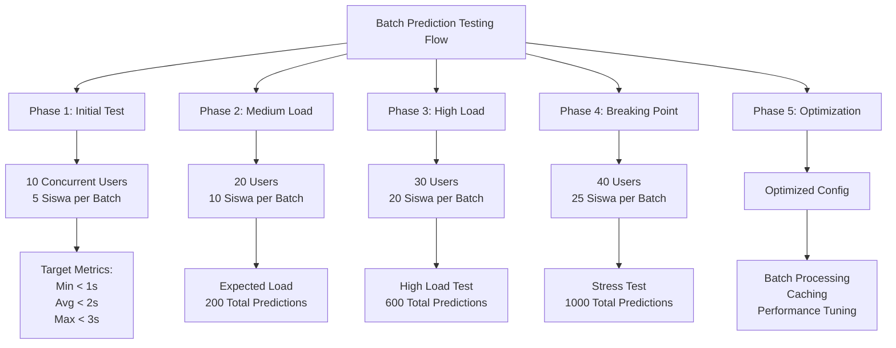
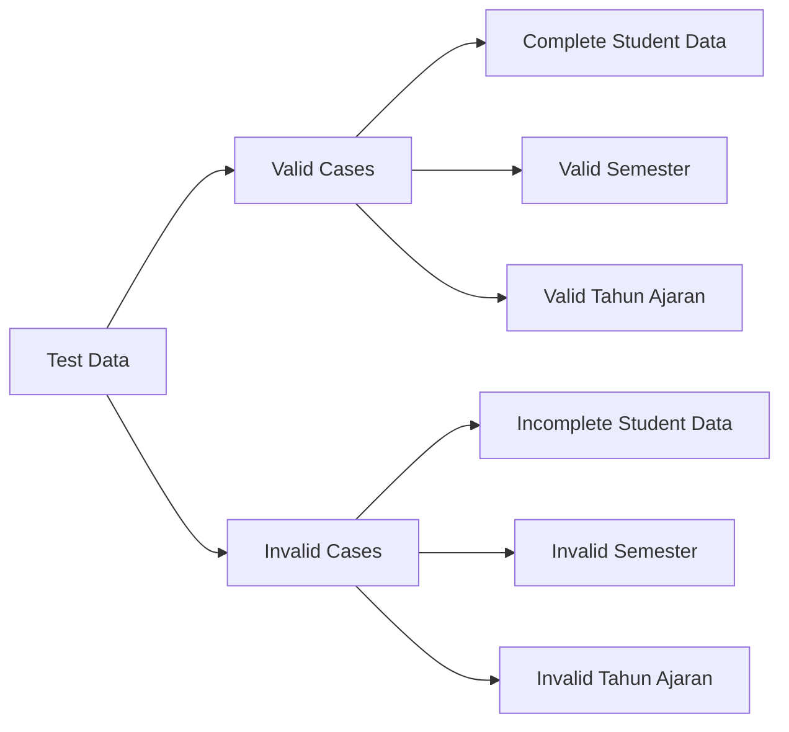
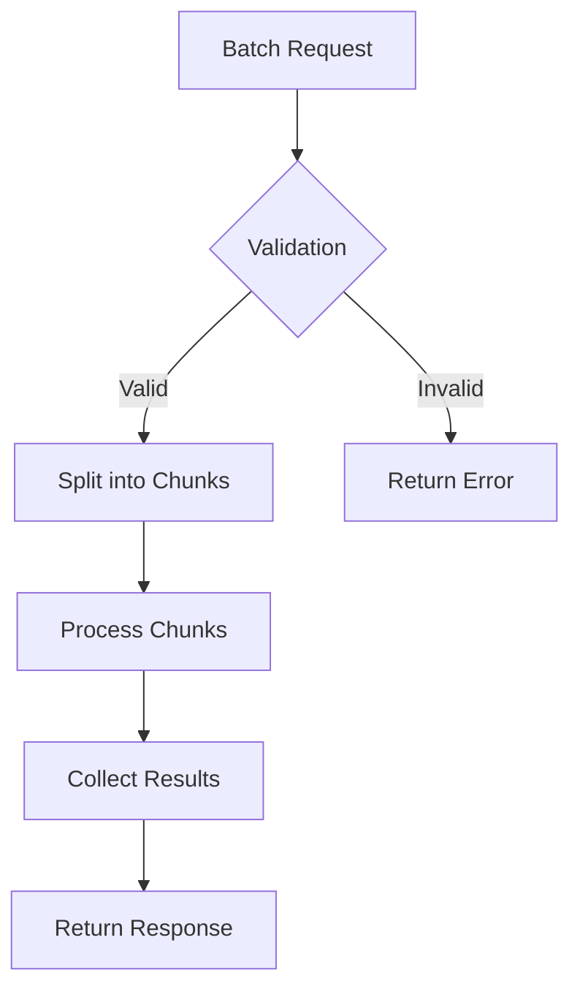

# Rencana Pengujian Batch Prediction Endpoint

## Ringkasan Eksekutif

Dokumen ini menjelaskan rencana pengujian untuk endpoint batch prediction yang akan menguji kemampuan sistem dalam memproses prediksi prestasi untuk multiple siswa secara bersamaan. Pengujian akan dilakukan dalam lingkungan Docker dengan menggunakan data yang sudah ada dalam database.

## Visualisasi Rencana Pengujian



## Metodologi Pengujian

### Endpoint Target
```
POST /api/prediksi/batch
Content-Type: application/json
Authorization: Bearer {token}

{
    "semester": string,
    "tahun_ajaran": string
}
```

### Fase Pengujian

#### 1. Initial Testing (50 Batch Requests)
- **Konfigurasi**
  - Concurrent Users: 10
  - Siswa per Batch: 5
  - Total Batch Requests: 50
- **Target Metrics**
  - Response Time: < 2s
  - Error Rate: 0%
  - Throughput: > 2 batch/s

#### 2. Medium Load (200 Total Predictions)
- **Konfigurasi**
  - Concurrent Users: 20
  - Siswa per Batch: 10
  - Total Batch Requests: 20
- **Target Metrics**
  - Response Time: < 3s
  - Error Rate: < 1%
  - Throughput: > 1.5 batch/s

#### 3. High Load (600 Total Predictions)
- **Konfigurasi**
  - Concurrent Users: 30
  - Siswa per Batch: 20
  - Total Batch Requests: 30
- **Target Metrics**
  - Response Time: < 4s
  - Error Rate: < 2%
  - Throughput: > 1 batch/s

#### 4. Breaking Point (1000 Total Predictions)
- **Konfigurasi**
  - Concurrent Users: 40
  - Siswa per Batch: 25
  - Total Batch Requests: 40
- **Observasi**
  - Maximum Response Time
  - System Resource Usage
  - Error Patterns
  - Memory Consumption

#### 5. Optimized Testing
- **Implementasi**
  - Batch Processing Optimization
  - Response Caching
  - Connection Pooling
  - Memory Management
- **Target Metrics**
  - Response Time: < 3s
  - Error Rate: 0%
  - Throughput: Stable

### Test Data Preparation



### Test Scenarios

1. **Valid Batch Requests**
   - Multiple existing students
   - Complete data per student
   - Valid semester & tahun ajaran
   - Valid token authentication

2. **Mixed Data Quality**
   - Combination of complete/incomplete data
   - Various academic performance levels
   - Different attendance patterns
   - Different economic backgrounds

3. **Authentication Scenarios**
   - Valid token
   - Expired token
   - Invalid token
   - Missing token

4. **Concurrent Access Patterns**
   - Multiple batches same semester
   - Different semesters parallel
   - Mixed valid/invalid batches

## Monitoring dan Metrics

### Key Performance Indicators (KPIs)
1. **Response Time**
   - Average batch processing time
   - 95th percentile
   - Maximum response time
   - Time per prediction in batch

2. **Throughput**
   - Batches per second
   - Predictions per second
   - Success rate per batch
   - Total predictions processed

3. **Resource Usage**
   - CPU utilization
   - Memory consumption
   - Database connections
   - Docker container metrics

4. **Error Rates**
   - Authentication failures
   - Data validation errors
   - System errors
   - Memory overflow incidents

## Expected Results

### Performance Targets
1. **Response Time**
   - Average: < 3s per batch
   - 95th percentile: < 4s
   - Maximum: < 5s
   - Per prediction: < 200ms

2. **Throughput**
   - Sustained: > 1 batch/s
   - Peak: > 2 batch/s
   - Predictions/second: > 20

3. **Resource Usage**
   - CPU: < 80%
   - Memory: < 85%
   - DB Connections: < 70%
   - Container Resources: < 90%

### Error Handling
1. **Expected Error Responses**
   - 400: Invalid batch request
   - 401: Unauthorized
   - 422: Unprocessable Entity
   - 429: Too many requests
   - 500: Internal Server Error

2. **Error Rate Targets**
   - System errors: < 0.1%
   - Validation errors: < 1%
   - Memory errors: < 0.01%
   - Authentication errors: < 0.5%

## Optimasi dan Tuning

### Batch Processing Strategy


### Performance Optimization
1. **Database Optimization**
   - Bulk data retrieval
   - Efficient JOIN operations
   - Connection pooling
   - Query optimization

2. **Application Level**
   - Chunk processing
   - Parallel processing
   - Memory management
   - Result caching

3. **Infrastructure**
   - Container resource limits
   - Load balancing
   - Resource scaling
   - Network optimization

## Docker Environment Setup

### Container Configuration
1. **Backend Service**
   - CPU: 2 cores
   - Memory: 2GB
   - Scale: 1 instance

2. **Database**
   - CPU: 2 cores
   - Memory: 4GB
   - Connections: 100 max

3. **Nginx**
   - CPU: 1 core
   - Memory: 512MB
   - Worker Processes: Auto

### Monitoring Setup
1. **Container Stats**
   - CPU Usage
   - Memory Usage
   - Network I/O
   - Container Health

2. **Application Metrics**
   - Request Rate
   - Response Time
   - Error Rate
   - Cache Hit Rate

## Kesimpulan

Rencana pengujian batch prediction ini dirancang untuk memastikan sistem dapat menangani prediksi massal dengan efisien dalam lingkungan Docker. Fokus utama adalah pada optimasi performa, manajemen resource, dan reliability sistem.

## Appendix

### Test Data Example
```json
{
    "valid_batch_request": {
        "semester": "Ganjil",
        "tahun_ajaran": "2023/2024"
    },
    "invalid_batch_request": {
        "semester": "Invalid",
        "tahun_ajaran": "2023"
    }
}
```

### JMeter Test Plan Structure
- Thread Groups Configuration
- HTTP Request Defaults
- HTTP Header Manager
- Response Assertions
- Throughput Shaping Timer
- Summary Report
- Aggregate Report 