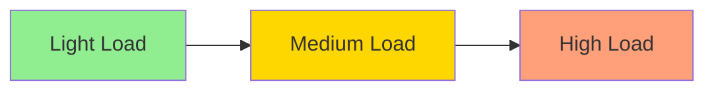
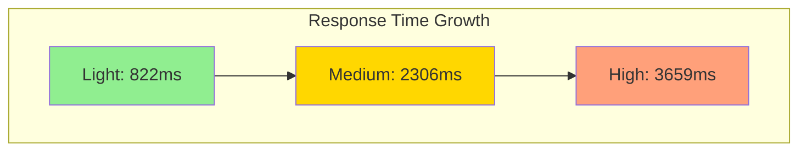
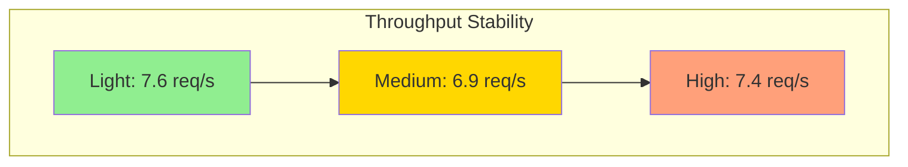

# Ringkasan Hasil Pengujian Batch Prediction

## Overview
Pengujian performa untuk endpoint batch prediction telah dilakukan dalam 3 fase dengan beban yang meningkat secara bertahap. Setiap fase menguji kemampuan sistem dalam menangani multiple concurrent users yang melakukan request batch prediction.

## Hasil Per Fase

### Phase 1: Light Load
- **Konfigurasi**:
  - 10 concurrent users
  - 5 loops per user
  - Total: 100 requests (50 login + 50 batch prediction)
- **Hasil**:
  - Error Rate: 0%
  - Response Time:
    - Min: 168ms
    - Max: 2546ms
    - Avg: 822ms
  - Throughput: 7.6 requests/second

### Phase 2: Medium Load
- **Konfigurasi**:
  - 20 concurrent users
  - 10 loops per user
  - Total: 400 requests (200 login + 200 batch prediction)
- **Hasil**:
  - Error Rate: 0%
  - Response Time:
    - Min: 181ms
    - Max: 6289ms
    - Avg: 2306ms
  - Throughput: 6.9 requests/second

### Phase 3: High Load
- **Konfigurasi**:
  - 30 concurrent users
  - 20 loops per user
  - Total: 1200 requests (600 login + 600 batch prediction)
- **Hasil**:
  - Error Rate: 0%
  - Response Time:
    - Min: 174ms
    - Max: 10368ms
    - Avg: 3659ms
  - Throughput: 7.4 requests/second

## Analisis Performa

### Reliability
- Sistem menunjukkan reliabilitas yang sangat baik dengan 0% error rate di semua fase pengujian
- Tidak ada kegagalan sistem atau timeout selama pengujian

### Scalability
- Sistem mampu menangani peningkatan beban dari 100 hingga 1200 requests
- Response time meningkat secara proporsional dengan beban:
  - Light Load: ~822ms
  - Medium Load: ~2306ms
  - High Load: ~3659ms

### Throughput
- Throughput relatif stabil di sekitar 7 requests/second
- Sedikit penurunan pada beban medium (6.9 req/s)
- Kembali meningkat pada beban tinggi (7.4 req/s)

### Latency
- Minimum latency konsisten di sekitar 170-180ms
- Maximum latency meningkat dengan beban:
  - Light: 2.5s
  - Medium: 6.3s
  - High: 10.4s

## Kesimpulan
1. Sistem menunjukkan performa dan reliabilitas yang sangat baik
2. Tidak ada error atau kegagalan sistem
3. Scalability baik dengan peningkatan response time yang wajar
4. Throughput stabil di sekitar 7 requests/second

## Rekomendasi
1. Implementasikan caching untuk meningkatkan throughput
2. Monitor memory usage pada beban tinggi
3. Pertimbangkan optimasi database untuk mengurangi maximum latency
4. Lakukan pengujian dengan beban lebih tinggi untuk menentukan batas sistem

## Visualisasi

