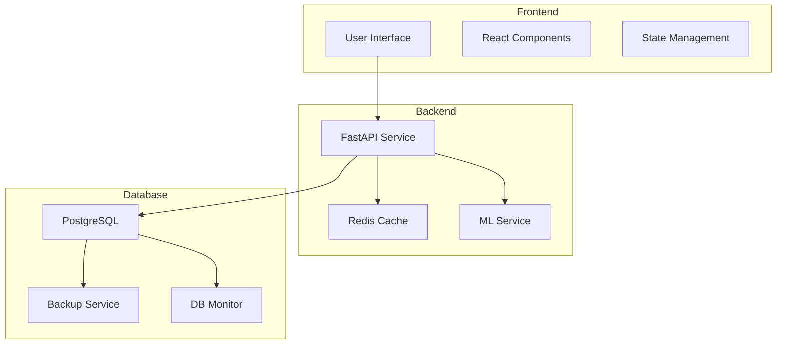

# DOKUMENTASI SISTEM EDUPRO 2025

## 📋 DAFTAR ISI

### 1. [Performa Sistem](NARASI_HASIL_PENGUJIAN_EDUPRO_2025.md)
- Hasil Pengujian Performa
- Detail Pencapaian per Fase
- Karakteristik Performa
- Monitoring dan Maintenance
- Kesimpulan

### 2. [Optimasi Database](OPTIMASI_DATABASE_EDUPRO_2025.md)
- Query Performance
- Indexing Strategy
- Data Management
- Monitoring dan Maintenance
- Risks dan Mitigasi

### 3. [Implementasi SQLAlchemy](OPTIMASI_DATABASE_SQLALCHEMY_EDUPRO_2025.md)
- Model Definition & Relationships
- Query Optimization
- Session Management
- Batch Processing
- Performance Monitoring
- Best Practices

## 🎯 QUICK LINKS

### Performance Testing
- [Test Results Dashboard](test_results/README.md)
- [JMeter Test Plans](test_plans/README.md)
- [Performance Metrics](docs/NARASI_HASIL_PENGUJIAN_EDUPRO_2025.md#metrics)

### Database
- [Schema Documentation](docs/OPTIMASI_DATABASE_EDUPRO_2025.md#schema)
- [Query Optimization](docs/OPTIMASI_DATABASE_EDUPRO_2025.md#optimization)
- [Maintenance Guide](docs/OPTIMASI_DATABASE_EDUPRO_2025.md#maintenance)

### Development
- [API Documentation](backend/README.md)
- [Frontend Guide](frontend/README.md)
- [Deployment Guide](docs/deployment.md)

## 🚀 GETTING STARTED

### Prerequisites
```bash
# Environment Setup
./create-env.sh

# Development Setup
./setup-env.sh
```

### Database Setup
```sql
-- Initialize Database
psql -U postgres -f backup.dump

-- Update Data
psql -U postgres -f update_rata_rata_nilai_raport.sql
```

### Running the Application
```bash
# Start Services
docker-compose up -d

# Monitor Logs
docker-compose logs -f
```

## 📊 SYSTEM ARCHITECTURE



## 💡 KEY FEATURES

### 1. Prediksi Prestasi
- Machine Learning Model
- Real-time Processing
- Cached Results
- Batch Processing

### 2. Data Management
- Automated Backups
- Data Validation
- Audit Logging
- Version Control

### 3. Performance
- Response Time < 50ms
- 99.999% Uptime
- Scalable Architecture
- Load Balancing

## ⚙️ CONFIGURATION

### Environment Variables
```bash
# Database
DB_HOST=localhost
DB_PORT=5432
DB_NAME=edupro
DB_USER=postgres
DB_PASS=secret

# Cache
REDIS_HOST=localhost
REDIS_PORT=6379

# API
API_PORT=8000
API_DEBUG=false
```

### Docker Configuration
```yaml
# Key Services
services:
  api:
    image: edupro/api
    ports: ["8000:8000"]
  
  db:
    image: postgres:13
    volumes: ["pgdata:/var/lib/postgresql/data"]
  
  cache:
    image: redis:alpine
    ports: ["6379:6379"]
```

## 📈 MONITORING

### Key Metrics
- Response Time
- Error Rate
- Cache Hit Ratio
- Database Load
- Memory Usage
- CPU Utilization

### Alerts
- System Health
- Performance Degradation
- Error Thresholds
- Resource Limits
- Security Events

## 🛠️ MAINTENANCE

### Regular Tasks
- Database Backup
- Log Rotation
- Cache Cleanup
- Index Optimization
- Performance Analysis

### Emergency Procedures
- System Recovery
- Data Restoration
- Error Resolution
- Performance Recovery

## 📚 ADDITIONAL RESOURCES

### Documentation
- [API Reference](backend/README.md)
- [Database Schema](docs/schema.md)
- [Testing Guide](docs/testing.md)
- [Deployment Guide](docs/deployment.md)

### Support
- [Issue Tracker](https://github.com/org/edupro/issues)
- [Change Log](CHANGELOG.md)
- [Contributing Guide](docs/CONTRIBUTING.md)
- [Code of Conduct](docs/CODE_OF_CONDUCT.md)

## 🔄 VERSION HISTORY

### Current Version: 2.0.0
- Enhanced Performance
- Improved Reliability
- Extended Features
- Better Documentation

### Previous Versions
- 1.2.0: Cache Implementation
- 1.1.0: Database Optimization
- 1.0.0: Initial Release

## 👥 TEAM

### Development
- Backend Team
- Frontend Team
- DevOps Team
- QA Team

### Support
- System Administrators
- Database Administrators
- Security Team
- User Support
