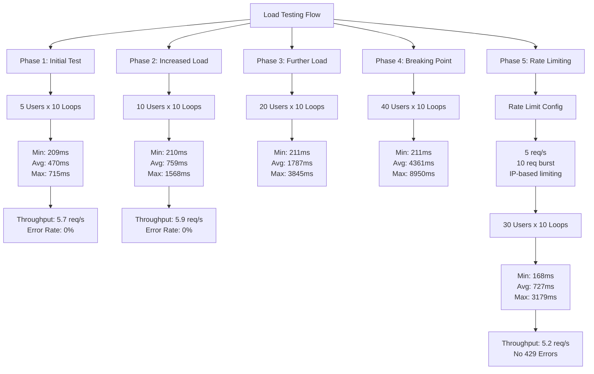
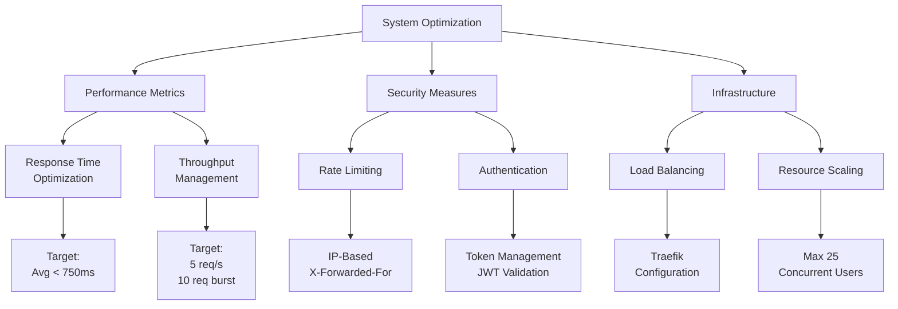

# Load Testing dan Optimasi Sistem Autentikasi

## Ringkasan Eksekutif

Dokumen ini menjelaskan hasil load testing dan optimasi sistem autentikasi pada aplikasi EduPro Prediction System. Testing dilakukan dalam beberapa fase dengan peningkatan beban bertahap untuk mengukur performa dan ketahanan sistem.

## Visualisasi Alur Testing

## Metodologi Testing

### Tools dan Teknologi
- JMeter untuk load testing
- Traefik sebagai reverse proxy
- FastAPI backend
- Token-based Authentication (JWT)

### Parameter Testing
- Concurrent Users: 5-40 users
- Test Duration: Bervariasi per fase
- Metrics: Response time, throughput, error rate
- Endpoints: Authentication dan API endpoints

## Hasil Testing

### Fase 1: Initial Testing (50 Requests)
- **Konfigurasi**
  - 5 concurrent users
  - 10 loops per user
- **Hasil**
  - Response Time
    - Minimum: 209ms
    - Average: 470ms
    - Maximum: 715ms
  - Throughput: 5.7 req/s
  - Error Rate: 0%

### Fase 2: Increased Load (100 Requests)
- **Konfigurasi**
  - 10 concurrent users
  - 10 loops per user
- **Hasil**
  - Response Time
    - Minimum: 210ms
    - Average: 759ms
    - Maximum: 1568ms
  - Throughput: 5.9 req/s
  - Performa: Degradasi terdeteksi namun sistem stabil

### Fase 3: Further Load (200 Requests)
- **Konfigurasi**
  - 20 concurrent users
  - 10 loops per user
- **Hasil**
  - Response Time
    - Minimum: 211ms
    - Average: 1787ms
    - Maximum: 3845ms
  - Impact: Signifikan pada performa

### Fase 4: Breaking Point Test (400 Requests)
- **Konfigurasi**
  - 40 concurrent users
  - 10 loops per user
- **Hasil**
  - Response Time
    - Minimum: 211ms
    - Average: 4361ms
    - Maximum: 8950ms
  - Status: Sistem stress terdeteksi

### Fase 5: Rate Limiting Implementation
- **Konfigurasi**
  - Traefik middleware
  - 5 req/s dengan burst 10 requests
  - IP-based limiting dengan X-Forwarded-For
- **Hasil Final (300 Requests)**
  - 30 concurrent users
  - Response Time
    - Minimum: 168ms
    - Average: 727ms
    - Maximum: 3179ms
  - Throughput: 5.2 req/s
  - Status: Tidak ada rejected requests

## Optimasi dan Rekomendasi

### Visualisasi Sistem Optimasi

### Konfigurasi Optimal
1. **Concurrent Users**
   - Maximum: 25 users
   - Recommended: 20 users untuk performa optimal

2. **Rate Limiting**
   - Request Rate: 5 req/s
   - Burst Capacity: 10 requests
   - Implementation: IP-based dengan X-Forwarded-For

3. **Response Time Targets**
   - Average: < 750ms
   - Maximum: < 3000ms

### Rekomendasi Teknis

1. **Performance Optimization**
   - Implementasi caching untuk token validation
   - Optimasi database connection pooling
   - Regular monitoring pada resource usage

2. **Security Measures**
   - Token refresh mechanism
   - Rate limiting per endpoint
   - IP-based request tracking

3. **Infrastructure Scaling**
   - Load balancing configuration
   - Resource allocation monitoring
   - Automatic scaling triggers

## Monitoring dan Maintenance

### Metrics to Monitor
1. **Performance Metrics**
   - Response times
   - Request rates
   - Error rates
   - Resource utilization

2. **Security Metrics**
   - Failed authentication attempts
   - Rate limit violations
   - Token refresh patterns

### Maintenance Tasks
1. **Regular Reviews**
   - Performance logs analysis
   - Security audit
   - Configuration optimization

2. **Update Procedures**
   - Rate limit adjustments
   - Scaling parameter updates
   - Security policy reviews

## Kesimpulan

Sistem menunjukkan performa yang stabil setelah implementasi rate limiting dan optimasi. Rekomendasi konfigurasi yang diberikan mampu menangani beban hingga 25 concurrent users dengan response time yang acceptable. Monitoring berkelanjutan dan adjustments diperlukan untuk memastikan performa optimal.

## Appendix

### Testing Scripts
- JMeter test plans
- Rate limiting configurations
- Monitoring scripts

### Reference Metrics
- Baseline performance data
- Optimization benchmarks
- Resource utilization patterns 