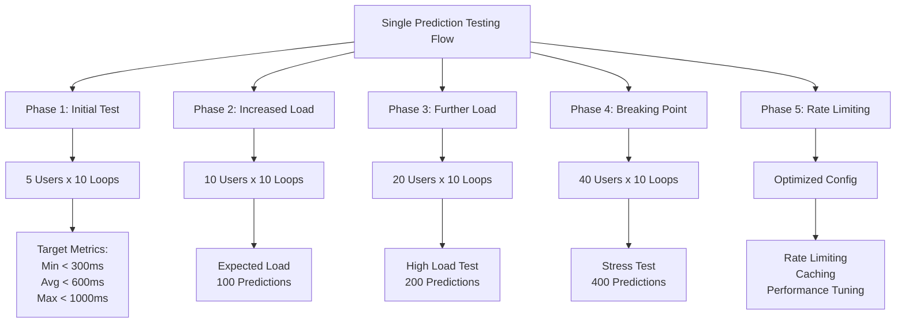
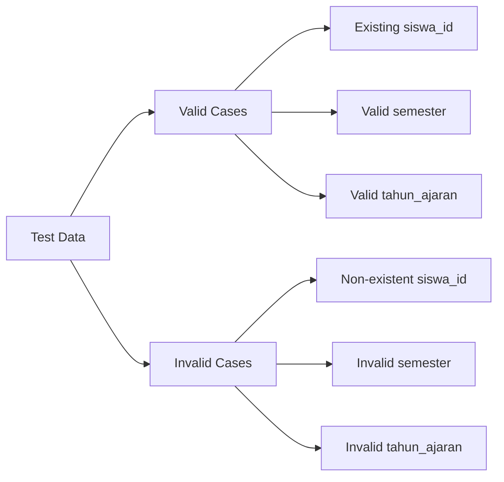
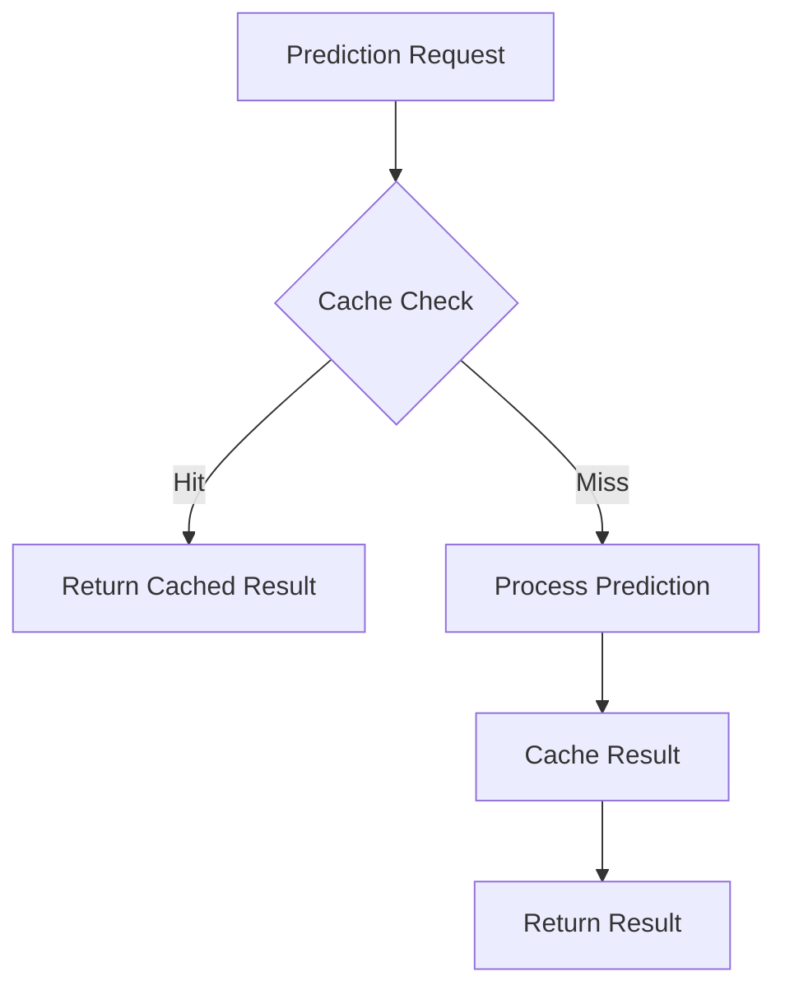

# Rencana Pengujian Single Prediction Endpoint

## Ringkasan Eksekutif

Dokumen ini menjelaskan rencana pengujian untuk endpoint single prediction dengan pola yang sama seperti pengujian authentication. Pengujian akan dilakukan secara bertahap untuk mengukur performa dan ketahanan sistem dalam menangani prediksi individual.

## Visualisasi Rencana Pengujian



## Metodologi Pengujian

### Endpoint Target
```
POST /api/prediksi/
Content-Type: application/json
Authorization: Bearer {token}

{
    "siswa_id": integer,
    "semester": string,
    "tahun_ajaran": string
}
```

### Fase Pengujian

#### 1. Initial Testing (50 Requests)
- **Konfigurasi**
  - Concurrent Users: 5
  - Loops per User: 10
  - Total Requests: 50
- **Target Metrics**
  - Response Time: < 300ms
  - Error Rate: 0%
  - Throughput: > 5 req/s

#### 2. Increased Load (100 Requests)
- **Konfigurasi**
  - Concurrent Users: 10
  - Loops per User: 10
  - Total Requests: 100
- **Target Metrics**
  - Response Time: < 500ms
  - Error Rate: < 1%
  - Throughput: > 8 req/s

#### 3. Further Load (200 Requests)
- **Konfigurasi**
  - Concurrent Users: 20
  - Loops per User: 10
  - Total Requests: 200
- **Target Metrics**
  - Response Time: < 800ms
  - Error Rate: < 2%
  - Throughput: > 10 req/s

#### 4. Breaking Point (400 Requests)
- **Konfigurasi**
  - Concurrent Users: 40
  - Loops per User: 10
  - Total Requests: 400
- **Observasi**
  - Maximum Response Time
  - System Resource Usage
  - Error Patterns

#### 5. Optimized Testing
- **Implementasi**
  - Rate Limiting
  - Response Caching
  - Connection Pooling
- **Target Metrics**
  - Response Time: < 600ms
  - Error Rate: 0%
  - Throughput: Stable

### Test Data Preparation



### Test Scenarios

1. **Valid Prediction Requests**
   - Existing student data
   - Complete parameters
   - Valid token authentication

2. **Invalid Requests**
   - Non-existent student ID
   - Invalid semester format
   - Invalid academic year
   - Missing parameters

3. **Authentication Scenarios**
   - Valid token
   - Expired token
   - Invalid token
   - Missing token

4. **Concurrent Access Patterns**
   - Same student multiple requests
   - Different students parallel requests
   - Mixed valid/invalid requests

## Monitoring dan Metrics

### Key Performance Indicators (KPIs)
1. **Response Time**
   - Average response time
   - 95th percentile
   - Maximum response time

2. **Throughput**
   - Requests per second
   - Successful predictions
   - Failed predictions

3. **Resource Usage**
   - CPU utilization
   - Memory usage
   - Database connections

4. **Error Rates**
   - Authentication failures
   - Validation errors
   - System errors

## Expected Results

### Performance Targets
1. **Response Time**
   - Average: < 500ms
   - 95th percentile: < 800ms
   - Maximum: < 1500ms

2. **Throughput**
   - Sustained: > 10 req/s
   - Peak: > 15 req/s
   - Concurrent users: 25

3. **Resource Usage**
   - CPU: < 70%
   - Memory: < 80%
   - DB Connections: < 60%

### Error Handling
1. **Expected Error Responses**
   - 400: Invalid request
   - 401: Unauthorized
   - 404: Student not found
   - 429: Too many requests

2. **Error Rate Targets**
   - System errors: < 0.1%
   - Validation errors: < 1%
   - Authentication errors: < 0.5%

## Optimasi dan Tuning

### Caching Strategy


### Performance Optimization
1. **Database Optimization**
   - Index optimization
   - Query caching
   - Connection pooling

2. **Application Level**
   - Response caching
   - Batch processing
   - Async processing

3. **Infrastructure**
   - Load balancing
   - Resource scaling
   - Rate limiting

## Kesimpulan

Rencana pengujian ini dirancang untuk memastikan endpoint single prediction dapat menangani beban yang diharapkan dengan performa yang optimal. Pengujian bertahap akan membantu mengidentifikasi bottlenecks dan area optimasi.

## Appendix

### Test Data Templates
```json
{
    "valid_request": {
        "siswa_id": 12345,
        "semester": "Ganjil",
        "tahun_ajaran": "2023/2024"
    },
    "invalid_request": {
        "siswa_id": 99999,
        "semester": "Invalid",
        "tahun_ajaran": "2023"
    }
}
```

### JMeter Test Plan Structure
- Thread Groups
- HTTP Requests
- Assertions
- Listeners
- Timer Configuration 