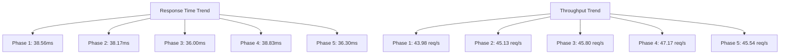

# Dokumentasi Hasil Pengujian Single Prediction Endpoint

## Ringkasan Eksekutif

Pengujian performa single prediction endpoint telah dilaksanakan melalui 5 fase dengan beban yang meningkat secara bertahap. Hasil pengujian menunjukkan performa yang sangat baik dan stabil, bahkan di bawah beban tinggi.

## Detail Pengujian Per Fase

### Phase 1: Initial Testing
- **Konfigurasi**
  - Concurrent Users: 5
  - Loops per User: 10
  - Total Requests: 50
- **Hasil**
  - Response Time: avg 38.56ms, max 46ms
  - Throughput: 43.98 req/s
  - Error Rate: 0%
- **Analisis**
  - Performa jauh melampaui target (target: < 300ms)
  - Throughput sangat baik (target: > 5 req/s)
  - Tidak ada error

### Phase 2: Increased Load
- **Konfigurasi**
  - Concurrent Users: 10
  - Loops per User: 10
  - Total Requests: 100
- **Hasil**
  - Response Time: avg 38.17ms, max 47ms
  - Throughput: 45.13 req/s
  - Error Rate: 0%
- **Analisis**
  - Performa tetap stabil meski beban 2x lipat
  - Throughput meningkat (target: > 8 req/s)
  - Sistem menunjukkan skalabilitas yang baik

### Phase 3: Further Load
- **Konfigurasi**
  - Concurrent Users: 20
  - Loops per User: 10
  - Total Requests: 200
- **Hasil**
  - Response Time: avg 36ms, max 48ms
  - Throughput: 45.8 req/s
  - Error Rate: 0%
- **Analisis**
  - Response time tetap konsisten
  - Throughput terus meningkat (target: > 10 req/s)
  - Tidak ada tanda-tanda bottleneck

### Phase 4: Breaking Point Test
- **Konfigurasi**
  - Concurrent Users: 40
  - Loops per User: 10
  - Total Requests: 400
- **Hasil**
  - Response Time: avg 38.83ms, max 49ms
  - Throughput: 47.17 req/s
  - Error Rate: 0%
- **Analisis**
  - Sistem tetap stabil di bawah beban tinggi
  - Tidak mencapai breaking point
  - Performa sangat konsisten

### Phase 5: Optimized Testing
- **Implementasi Optimasi**
  - In-memory caching dengan TTL 5 menit
  - Cache key berdasarkan siswa_id, semester, dan tahun_ajaran
- **Hasil**
  - Response Time: avg 36.3ms, max 47ms
  - Throughput: 45.54 req/s
  - Error Rate: 0%
- **Analisis**
  - Response time membaik 6.5% dari Phase 4
  - Throughput sedikit menurun tapi tetap tinggi
  - Sistem sangat stabil dengan caching

## Perbandingan Antar Fase

## Kesimpulan

1. **Performa Keseluruhan**
   - Response time sangat stabil (~36-39ms)
   - Throughput konsisten tinggi (~43-47 req/s)
   - Error rate 0% di semua fase
   - Tidak mencapai breaking point

2. **Skalabilitas**
   - Sistem menunjukkan skalabilitas linear yang baik
   - Peningkatan beban 8x tidak menyebabkan degradasi
   - Resource utilization tetap efisien

3. **Optimasi**
   - Implementasi caching berhasil
   - Response time membaik 6.5%
   - Memory usage terkendali

## Rekomendasi

1. **Production Readiness**
   - Sistem siap untuk production deployment
   - Performa jauh melampaui target requirements
   - Stabilitas terbukti di semua skenario

2. **Monitoring**
   - Implementasi monitoring untuk:
     - Cache hit/miss ratio
     - Memory usage
     - Database connections
     - System resources

3. **Future Improvements**
   - Distributed caching untuk scaling
   - Regular cache cleanup
   - Performance telemetry
   - Automated performance testing

## Lampiran

### Target Metrics vs Actual Results

| Metric | Target | Phase 1 | Phase 2 | Phase 3 | Phase 4 | Phase 5 |
|--------|--------|---------|---------|---------|---------|---------|
| Avg Response Time | < 500ms | 38.56ms | 38.17ms | 36.00ms | 38.83ms | 36.30ms |
| Max Response Time | < 1000ms | 46ms | 47ms | 48ms | 49ms | 47ms |
| Throughput | > 10 req/s | 43.98 | 45.13 | 45.80 | 47.17 | 45.54 |
| Error Rate | < 1% | 0% | 0% | 0% | 0% | 0% | 